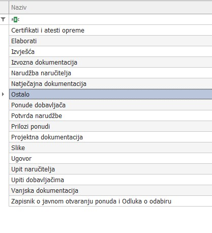
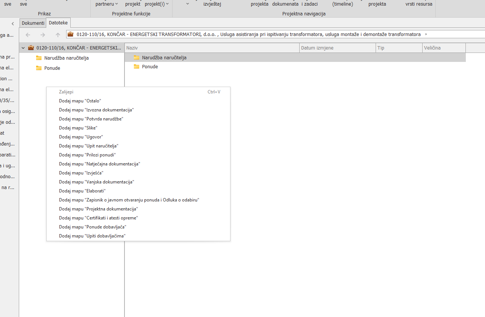

# ERP/DMS sustav

## 
**DMS sustav**

    U AltiBiz programu dodali smo DMS sustav i podesili na način kako trenutno funkcionira kako  bismo bolje organizirali dokumente, zaštitili važne informacije te usmjerili pristupanje datotekama isključivo kroz DMS u Altibizu (da se ne koristi File Explorer). Svi folderi u glavnom dijelu projekta dodaju se isključivo kroz AltiBiz sustav a sve kako bi imali uniformnost - da svi sve dokumente spremaju na isti način i na ista mjesta u bazi projekata". Ova uputstva objašnjavaju kako to funkcionira i kako koristiti DMS.

## 
**Vrste DMS mapa**

U sustavu postoji popis unaprijed definiranih foldera, slika gore. Podatci u tim folderima vidljivi su samo korisnicima koji imaju postavljena prava na odrečeni folder. Prava mogu biti: **Čitaj**, **Dodaj**, **Izmijeni** i **Izbriši**
 
Ukoliko korisnik nema postavljeno niti jedno od ovih prava na nekom folderu, nebude vidio taj folder u DMSu
 
 
Folder "Ostalo" - ovaj folder vide svi korisnici i unutar njega svatkomože dodavati svoje foldere sa proizvoljnim nazivima. 
 
 Svi folderi i fajlovi unutar ovog foldera dostupni su svima i svi ih mogu mijenjati/brisati

## 
**Dodavanje foldera**

Kada želite dodati novi folder u glavni dio projekta, desnim klikom miša na projekt dobit ćete samo te unaprijed definirane opcije.
Ne možete sami smišljati nazive foldera za glavni dio – samo oni iz popisa su dopušteni.

