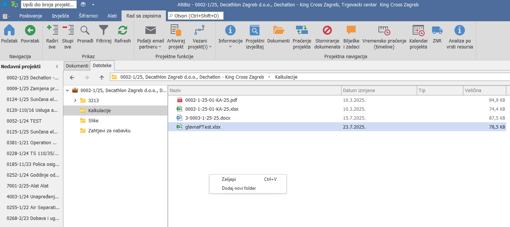

# ERP/DMS sustav

## 
**DMS sustav**

    Namjena DMS sustava (Document Management System) unutar Altibiza je sustavna pohrana i organizacija dokumenata, zaštita važnih informacija te pristupanje datotekama isključivo kroz isto sučelje (da se ne koristi File Explorer) u skladu s pravima pristupa pojedinog korisnika.  Svi folderi u glavnom dijelu projekta dodaju se isključivo kroz AltiBiz sustav a sve kako bi imali uniformnost - da svi sve dokumente spremaju na isti način i na ista mjesta u bazi projekata. Ova uputstva objašnjavaju kako to funkcionira i kako koristiti DMS.

## 
**Vrste DMS mapa**

U sustavu postoji popis unaprijed definiranih foldera, slika gore. Podatci u tim folderima vidljivi su samo korisnicima koji imaju postavljena prava na određeni folder. Prava mogu biti: **Čitaj**, **Dodaj**, **Izmijeni**, **Izbriši**
 
Ukoliko korisnik nema postavljeno niti jedno od ovih prava na nekom folderu, neće vidjeti taj folder u DMSu
 
 
Folder "Ostalo" - ovaj folder vide svi korisnici i unutar njega svatko može dodavati svoje foldere sa proizvoljnim nazivima. 
 
 Svi folderi i fajlovi unutar ovog foldera dostupni su svima i svi ih mogu mijenjati/brisati

## 
**Dodavanje foldera**

Kada želite dodati novi folder u glavni dio projekta, desnim klikom miša na projekt dobit ćete samo te unaprijed definirane opcije.
Ne možete sami smišljati nazive foldera za glavni dio – samo oni iz popisa su dopušteni.

## 
**Kopiranje dokumenata u DMS**

**Kopiranje u DMS možemo napraviti na 3 načina:**
 

**1. Klikanje po meniju**: Desni klik na dokument koji želimo kopirati, kliknuti "Kopiraj" u izborniku, zatim u AltiBizu na nekom projektu u tabu "Datoteke", desni klik na odredišnu mapu i odabrati "Zalijepi". Također može se samo u lijevom dijelu selektirati mapu u koju želimo kopirat, a u desnom dijelu desni klik i zalijepi.
 

**2. Copy-Paste preko tipkovnice**: Označite dokument ili njegov dio, pritisnite Ctrl+C za kopiranje, zatim u AltiBizu na nekom projektu u tabu datoteke odaberemo Folder u koji želimo zalijepiti fajl  i Ctrl+V kako bi zaljepili fajl.
 

**3. Drag and Drop**: U AltiBizu odemo na neki projekt u tab "Datoteke" i odaberemo folder u koji želimo nešto kopirati. Pronađite dokument koji hoćete staviti u DMS i odvucite dokument mišem (lijevi klik i držanje) sa te lokacije i ispustite ga u altibizu na selektiranoj lokaciji.