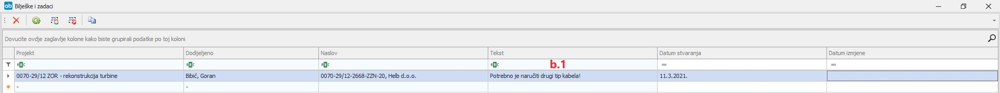

# Digitalno odobravanje dokumenata 

### 
**Digitalno odobravanje dokumenata** 

**
Put: Poslovanje → Dokumenti → Odobravanje dokumenata**  

 * Odobravanje dokumenata se prvenstveno provodi po principu nadređenih grupa pa tek onda ostalih uvjeta ovisno o potrebama pojedinih dokumenata/odjela *

Voditelj pojedinog odjela zadužen za odobravanje određenih dokumenata dobiva zahtjev za odobravanjem dokumenata za koje je on osobno zadužen/nadležan

1. Obavijesti o odobravanju dokumenata se zaprima u izborniku „Obavijesti“ i na „Mail“

    #### 
Obavijesti unutar Altibiza
    

    #### 
Obavijest unutar mail preglednika
    
      

2. Nakon što je voditelj odjela zaprimio obavijest o odobravanju dokumenta ima 2 opcije:

    2.1) **Odobriti zahtjev**  (koji se nakon odobrenja direktno prosljeđuje **odjelu nabave** i spreman je za naručivanje)

    2.2) **Odbiti zahtjev**  (koji se nakon odbijanja vraća korisniku uz obavijest u izborniku “Obavijesti” i na mail)    

    
 Poslovanje → Obavijesti
    

    
 Poslovanje → Dokumenti → Odobravanje dokumenata
    
      

    b.1) Prilikom odbijanja zahtjeva osobi koja je odbila zahtjev se automatski nudi opcija “**Bilješke i zadaci**” kroz koju točno može obavijestiti podnositelja zahtjeva o elementima koje treba ispraviti 

    b.2) Ukoliko se unesu “Bilješke i zadaci” podnositelj će dobiti 2 maila (mail da je dokument odbijen i mail što je potrebno izmijeniti)  i 2 obavijesti (obavijest da je dokument odbijen i obavijest što je potrebno izmijeniti >Obavijesti -entitet “**TaskNote**”<)

    b.3) Nakon ispravka/dorade na odbijenom dokumentu korisnik ponavlja cijeli process.    

    

    