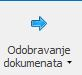
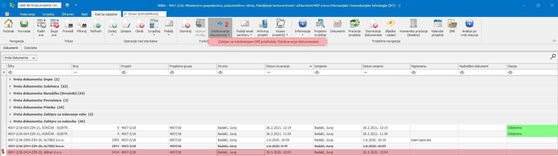
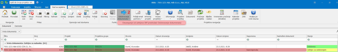
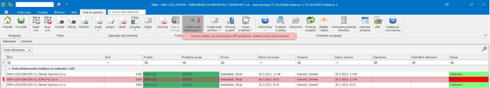

# Digitalno zahtijevanje odobravanja dokumenata

### 
**Digitalno zahtijevanje odobravanja dokumenata**

**
Put: Poslovanje → Projekti → Dokumenti**  

 * Zahtjev za odobrenjem dokumenata vrijedi za: Zahtjev za nabavku(ZZN), Kalkulaciju(KA), Ponudu(PO) i Prilog Ponude(PP) *

#### Postupak podnošenja zahtjeva: 

1. Unutar projekta se pozicionirate na dokument koji je potrebno odobriti    
2. Nakon toga u tabu “Funkcije” iz padajućeg izbornika “Odobravanje dokumenata” odabirete opciju Zahtjev za odobrenjem ako je zahtjev spreman za odobrenje tj. ako je prethodno kreiran

  

#### Postupak odustajanja od podnešenog zahtjeva: 

1. Ukoliko iz nekog razloga želite odustati od zahtjeva koji je u međuvremenu poslan na odobravanje (a još nije niti odobren niti prihvaćen) prvo se unutar projekta pozicionirate na taj isti dokument za koji je već poslan zahtjev za odobrenjem       
2. Nakon toga u tabu “Funkcije” iz padajućeg izbornika “Odobravanje dokumenata” odabirete opciju Odustajanje od zahtjeva  

  

#### Postupak ponovnog podnošenja zahtjeva:

1. Ako je zahtjev koji je poslan na odobrenje iz nekog razloga odbijen (netočna cijena,datum isporuke…), nakon što su ispravljeni podaci ponovo se pozicionirate na taj isti dokument za koji je već poslan zahtjev za odobrenjem a isti je prethodno odbijen    
2. Nakon toga u tabu “Funkcije” iz padajućeg izbornika “Odobravanje dokumenata” odabirete opciju Ponovi zahtjev za odobrenjem    

  

    