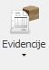

## Evidencije(Knjige evidencija)

**Put(1): Poslovanje → Dokumenti → Evidencije**

**Put(2): Poslovanje → Projekt → Dodaj(+) → Odjel → Dokument/Knjiga**  

 

### TEHNIČKI URED  

  

**Knjiga projekata / Projektna dokumentacija **  

|   R.B	|   Broj projekta	|   Broj tehničke dokumentacije	|   Naručitelj	|   Opis projekta	|   Inačica	|   Br. listova	|   Registrator	|   Datum	|   Potpis	|  
|---	|---	|---	|---	|---	|---	|---	|---	|---	|---	|

**R.B**  
-> Generira se po trenutnom redoslijedu (automatski)  

**Broj projekta**  
-> Unosi se broj projekta (ručno)  

**Broj tehničke dokumentacije**  

-> Sastoji se od: 0279-1/19 - 2091 – TD – 20

– **Broja projekta** (povlači se iz polja „Broj projekta“)

– **R.B** (generira se automatski i povlači iz polja „R.B“)

– **TD** (tehnička dokumentacija\tehnical documentation , uvijek je ista oznaka i oznaka TD mora biti fiksna)

– **20** (tekući broj aktualne godine)  

**Naručitelj**
-> Dodati padajući izbornik s partnerima (automatski iz padajućeg izbornika)

**Opis Projekta**
-> Upisuje se ime projekta + dodatni tekst (ručno)

**Inačica**
-> Upisuje se zadnja verzija zapisnika/dokumentacije, npr.1,2,3… (ručno)

**Br. Listova**
-> Upisuje se ukupan broj listova navedenog zapisnika/dokumentacije (ručno)

**Registrator**
-> Unosi se broj registratora u kojega se fizički pohranjuje zapisnik/dokumentacija (ručno)

**Datum**
-> Datum unosa zapisnika u sustav (automatski taj dan)

**Potpis**
-> Defaultno ime korisnika koji je unio zapisnik/dokumentaciju (automatski)

  
  
  

### ODJEL ISPITIVANJA  

  

**Knjiga zapisnika o ispitivanju**

|   R.B	|   Broj projekta	|   Broj zapisnika	|   Naručitelj	|   Opis predmeta	|   Registrator	|   Datum	|   Potpis	|  
|---	|---	|---	|---	|---	|---	|---	|---	|

**R.B**
-> Generira se po trenutnom redoslijedu (automatski)

**Broj projekta**

-> Unosi se broj projekta (ručno)

**Broj zapisnika**

-> Sastoji se od: **5624 – 0143-1/20 – QC - 21**

– **R.B** (generira se automatski i povlači iz polja „R.B“)

– **Broja projekta/posla** (povlači se iz polja „Broj projekta“)

– **QC** (kontrola kvalitete\ quality control, uvijek je ista oznaka i oznaka QC mora biti fiksna)(automatski)

– **21** (tekući broj aktualne godine)(automatski)

**Naručitelj**

-> Dodati padajući izbornik s partnerima (automatski iz padajućeg izbornika)

**Opis predmeta**

-> Upisuje se vrsta zapisnika izvedenog ispitivanja (ručno)

**Registrator**

-> Unosi se broj registratora u kojega se fizički pohranjuje zapisnik/dokumentacija (ručno)

**Datum**

-> Datum unosa zapisnika u sustav (automatski taj dan)

**Potpis**

-> Defaultno ime korisnika koji je unio zapisnik/dokumentaciju (automatski)

  
  

**Knjiga proizvoda**

| R.B | Broj Projekta | Serijski broj | Naručitelj | Opis proizvoda | Datum | Potpis |
|---|---|---|---|---|---|---|

**R.B**

-> Generira se po trenutnom redoslijedu (automatski)

**Broj projekta**

-> Unosi se broj projekta (odabir iz padajućeg izbornika)

**Serijski broj**

-> od 1360 / 2020

– **R.B** (generira se automatski i povlači iz polja „R.B“)

– **20** (tekući broj aktualne godine)(automatski)

**Naručitelj**

-> Dodati padajući izbornik s partnerima (automatski iz padajućeg izbornika)

**Opis proizvoda**

-> Upisuje se ime proizvoda + dodatni tekst (ručno)

**Datum**

-> Datum unosa zapisnika u sustav (odabir datuma iz kalendara)

**Potpis**

-> Defaultno ime korisnika koji je unio zapisnik/dokumentaciju (automatski)

  
  

**Knjiga izjava o sukladnosti**

| R.B | Broj Projekta | Broj izjave | Naručitelj | Opis proizvoda | Serijski broj | Datum | Potpis |
|---|---|---|---|---|---|---|---|

**R.B**

-> Generira se po trenutnom redoslijedu (automatski)

**Broj projekta**

-> Unosi se broj projekta (ručno)

**Broj izjave**

->Sastoji se od **1360 – 8052-1/20 – DC – 20**

– **R.B** (generira se automatski i povlači iz polja „R.B“)

– **Broja projekta/posla** (povlači se iz polja „Broj projekta“)(automatski)

– **DC** (izjava o sukladnosti \ declaration of conformity, uvijek je ista oznaka i oznaka DC mora biti fiksna)(automatski)

– **20** (tekući broj aktualne godine)(automatski)

**Naručitelj**

-> Dodati padajući izbornik s partnerima (automatski iz padajućeg izbornika)

**Opis proizvoda**

-> Upisuje se ime proizvoda + dodatni tekst (ručno)

**Serijski broj**

-> Sastoji se od: **1841 / 2020**

– Broj koji se nalazi u knjizi proizvoda i generira se po redoslijedu (ručno/automatski)

– **2020** (tekući broj aktualne godine) (automatski)

**Datum**

-> Datum unosa zapisnika u sustav (automatski taj dan)

**Potpis**

-> Defaultno ime korisnika koji je unio zapisnik/dokumentaciju (automatski)

### ODJEL ZAŠTITE NA RADU

### ODJEL ENERGETSKE UČINKOVITOSTI