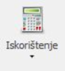
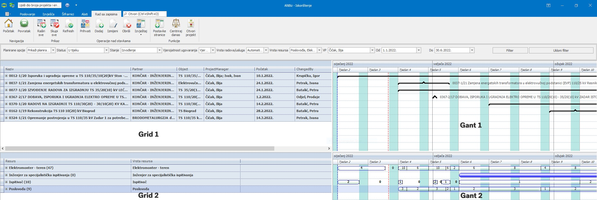

# Iskorištenje

### 
**Pregled planiranih/neplaniranih resursa**

**
Put: Poslovanje → Resursi → Iskorištenje**

U glavnom izborniku Iskorištenje se nalaze sljedeći filteri/polja/akcije:

1. Padajući izbornik „**Planirane opcije**“ služi za prikaz projekata koji:

    a) **Prikaži planirano** (već postoje isplanirane aktivnosti na projektu)

    b) **Prikaži neplanirano** (trenutno ne postoje dodijeljene aktivnosti na projektu)

2. Padajući izbornik “**Status**“ nudi odabir trenutnih statusa na projektima

    Vrste statusa: Nije postavljeno, U tijeku, Završen, Odgođen, Ne nudimo, Prekinuto, Ponuđen

3.  Padajući izbornik “**Stanje**“ nudi odabir trenutnih stanja na projektima

    Vrste stanja:  Razmatranje, Nuđenje, Izvođenje, Razvoj

4. Padajući izbornik “**Vjerojatnost ugovaranja**“ nudi odabir vjerojatnosti ugovaranja nekog projekta

    Vrste ugovaranja: Vjerojatnost 100%, Vjerojatnost od 60 do 80%, Vjerojatnost manja od 50%

5. Padajući izbornik “**Vrsta radova/usluga**“ nudi odabir vrste radova/usluga na projektima

    Vrste radova/usluga: Automatizacija, Bravarski radovi, Elektromontažni radovi, Energetska učinkovitost, Ispitivanje, Prodaja/isporuka, Proizvodnja, Projektiranje, Razvoj, Servis, Stručne usluge, Vođenje projekata

6. Padajući izbornik “**Vrsta resursa**“ nudi odabir vrste radova/usluga na projektima

    Vrste resursa: Poslovođa, Elektromonter – teren, Bravar, Projektant, Ispitivač, Elektromonter proizvodnja, Pomoćni monter, Projektant suradnik, Vodeći ispitivač, Voditelj projekta…

7. Padajući izbornik “**VP**“ nudi odabir voditelja projekta čije projekte želimo prikazati

8. Padajući izbornik “**Od**“ služi za odabir početnog vremena praćenja aktivnosti na projektima

9. Padajući izbornik “**Do**“ služi za odabir završnog vremena praćenja aktivnosti na projektima

10. Akcija „**Filter**“ služi za filtriranje svih prethodno odabranih polja za praćenje aktivnosti na projektima

11. Akcija „**Ukloni Filter**“ služi za brisanje svih prethodno odabranih polja za praćenje aktivnosti na projektima

  

**
– Grid 1 – 
**

Stupac „**Naziv**“ prikazuje broj i ime projekta koji se prikazuje

Stupac „**Partner**“ prikazuje partnera s kojim Helb sudjeluje na tom projektu

Stupac „**Objekt**“ prikazuje objekt na kojemu se izvode radovi

Stupac „**Projekt Menager**“ prikazuje glavnu osobu zaduženu za vođenje tog projekta

Stupac „**Početak**“ prikazuje početak/startni datum projekta

Stupac „**Kraj**“ prikazuje kraj/krajnji datum projekta

Stupac „**Trajanje**“ prikazuje proteklo vrijeme između početnog i krajnjeg datuma projekta

Stupac „**ChangeBy**“ prikazuje promjenu na kalkulacijskom djelu projekta

 

**
– Grid 2 – 
**

Stupac „**Resurs**“ prikazuje vrstu usluga/radova koji se izvode

Stupac „**Vrsta resursa**“ prikazuje radno mjesto koje izvodi vrstu usluga/radova

  

**
– Gant 1 – 
**

Prikazuje gantogram koji sadrži sve podatke u projektu prikazane u vremenskom okruženju (prikazuje ih grafički) koje sadrži detaljne podatke o satima, danima, tjednima, mjesecima i godinama radi lakšeg praćenja projekata

 
**
– Gant 2 – 
**

Prikazuje gantogram koji sadrži sve podatke o vrstama resursa i resursima koji su dodijeljeni kao aktivnost na projekt i grafički ih prikazuje u prethodno zadanom vremenskom okruženju

    