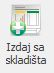

# Izdavanje robe sa skladišta (Helba)

### 
**Izdavanje robe sa skladišta (Helba)**

**
Put: Poslovanje → Nabava → Naručivanje → Izdaj sa skladišta**  

1. **PROJEKT  (\*obavezno polje\*)**     
    Iz padajućeg izbornika se odabire projekt s kojega će se izdati materijal/oprema te će se taj isti projekt teretiti za navedeni materijal/opremu

2. **ŠIFRA** (\**automatski se generira prilikom kreiranja zahtjeva za izdavanjem robe**)  

3. **VRSTA NARUDŽBE** (\*Zahtjev za izdavanje robe ( ZIR )\*)     

4. **DATUM NARUČIVANJA** (\**automatski se generira na dan kreiranja zahtjeva**)

5. **ROK ISPORUKE**     
    Iz padajućeg izbornika se odabire željeni datum do kojega bi naručeni materijal/oprema trebali biti isporučeni/spremni za podizanje

6. **DOBAVLJAČ**     
    Iz padajućeg izbornika odabire se dobavljač koji će isporučiti zahtjevani materijal/opremu

7. **IZRADIO** (\**automatski se popunjava s imenom korisnika koji je izradio zahtjev**)

8. **ODOBRIO  (\*obavezno polje\*)**   

9. **STATUS**   

10. **MONETA**  
    Iz padajućeg izbornika se odabire željena moneta

11. **TEČAJ ODABRANE VALUTE**  
    Unosi se tečaj za monetu koja je prethodno odabrana (\*vrijedi za sve monete osim kn*)

12. **OSNOVICA** ( \*rezultat množenja „Jedinične cijene (kn)“ x „Količine“ *)

13. **OSNOVICA U VALUTI** ( \*rezultat množenja „Jedinične cijene u valuti“ x „Količine“ *)

    