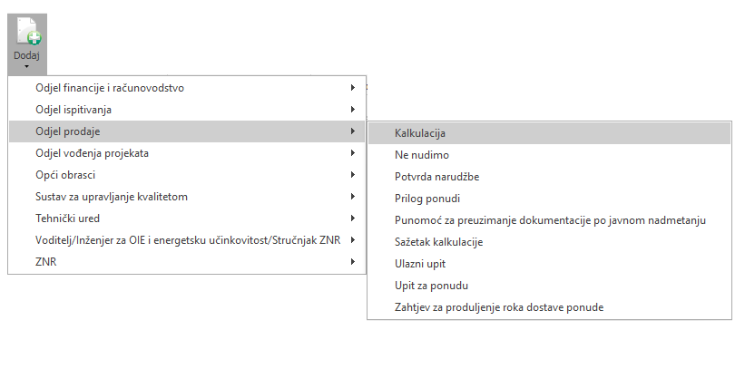

# Kalkulacija  

### 
**Dodavanje nove kalkulacije**  

**
Put: Projekt → Dodaj → Odjel prodaje → Kalkulacija**  

1. **NAZIV (\*obavezno polje\*)**   
Unosimo naziv/ime elementa kataloga kojega dodajemo

2. **TIP (\*obavezno polje\*)**      
Unosimo tip elementa kataloga

<!-- Add this button to download the page as PDF -->

    <button id="downloadPDF" style="font-size:16px; padding:10px 20px; cursor:pointer;">Download as PDF</button>

<!-- Include html2pdf.js library -->

<!-- Add JavaScript to generate PDF -->

    
