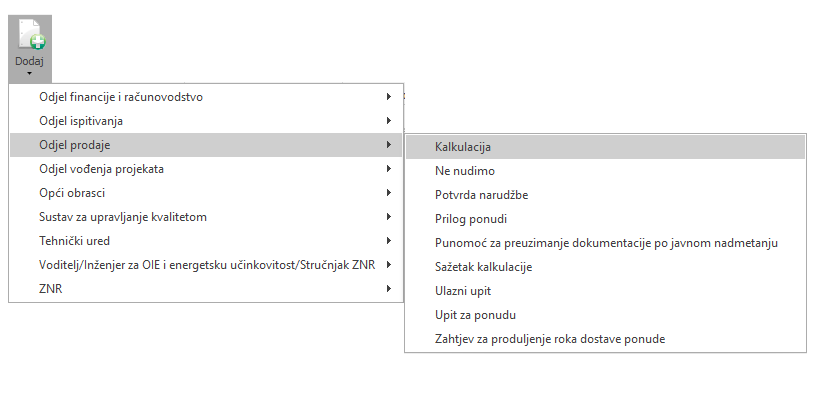
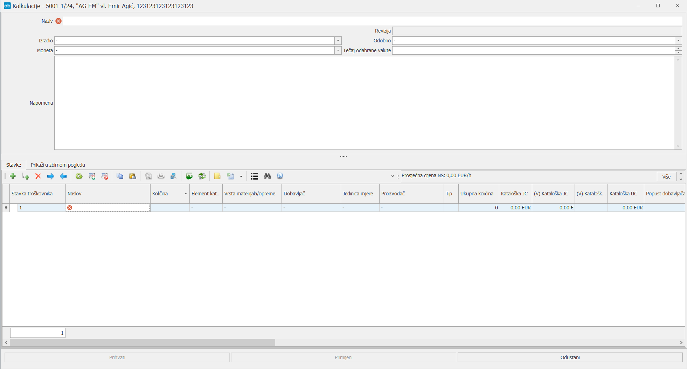

# Kalkulacija  

### 
**Dodavanje nove kalkulacije**

**
Put: Projekt (status: U nuđenju) → Dodaj → Odjel prodaje → Kalkulacija**
  

Projekti kojima je moguće dodati kalkulaciju moraju biti u **stanju**: **Nuđenja**, **Razmatranja** ili **Razvoja** te imati **status**: **U tijeku** ili **Ponuđen**

1. **NAZIV (\*obavezno polje\*)**   
Unosimo naziv/ime kalkulacije koju  dodajemo

2. **IZRADIO**      
    Iz padajućeg izbornika se odabire osoba koja radi kalkulaciju

3. **MONETA**    
    Odabire se moneta kalkulacije

4. **TEČAJ ODABRANE VALUTE**    
    Unosi se tečaj za monetu koja je prethodno unesena (\*vrijedi za sve monete osim kn*) 

5. **NAPOMENA**    
    U ovo se polje upisuju dodatne napomene za kalkulaciju koje mogu kasnije koristiti korisniku kao podsjetnik

