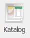

# Katalog  

### 
**Unos stavaka u katalog**  

**
Put: Poslovanje → Resursi → Katalog**  

1. **NAZIV (\*obavezno polje\*)**   
Unosimo naziv/ime elementa kataloga kojega dodajemo

2. **TIP (\*obavezno polje\*)**      
Unosimo tip elementa kataloga

3. **BUTTONI (Normativ i Cjenik)**   
**a)** Normativ - odabirom ove opcije unosimo podatke u slijedeća polja:
"Jedinični NS" unosimo vrijeme/broj koje je potrebno za ugradnju/instalaciju odabranog elementa kataloga u jedinici vremena(h) "Vrsta NS" iz padajućeg izbornika izabiremo vrstu norma/sata koja je potrebna za ugradnju/instalaciju odabranog elementa kataloga  
Svaka vrsta norma/sata ima svoju vrijednost koja se definira u izborniku "Vrste radnih sati" a njezina vrijednost se prikazuje u kalkulaciji ovisno o tome koja je vrsta norma sata odabrana "Vrsta radova/usluga" iz padajućeg izbornika odabiremo vrstu radova/usluga koja se odnosi na ovaj element kataloga , a koji se drfinira u izborniku "Referentna lista" - "Vrsta radova/usluga"  
**b)** Cjenik - odabirom ove opcije i nakon unosa "Kataloške cijene" u tabu „Cijene“ pamti se definirana cijena za taj element i ista se koristi u kalkulaciji prilikom odabira tog elementa kataloga

4. **PROIZVOĐAČ**       
Unos proizvođača navedenog elementa kataloga (ako je isti poznat)

5. **JEDINICA MJERE (\*obavezno polje\*)**   
Unos jedinice mjere koja je mjerodavna za navedeni element kataloga

6. **VRSTA MATERIJALA/OPREME (\*obavezno polje\*)**     
Odabir predefiniranih kategorija u koju ovaj element kataloga pripada

7. **PRETPOSTAVLJENI DOBAVLJAČ**    
Odabir dobavljača koji se najčešće koristi, element kataloga može imati više različitih dobavljača

<a href="../documents/Pravilan unos stavaka u katalog.pdf" target="_blank">
    
    Pravilan unos stavaka u katalog.pdf
</a>

    