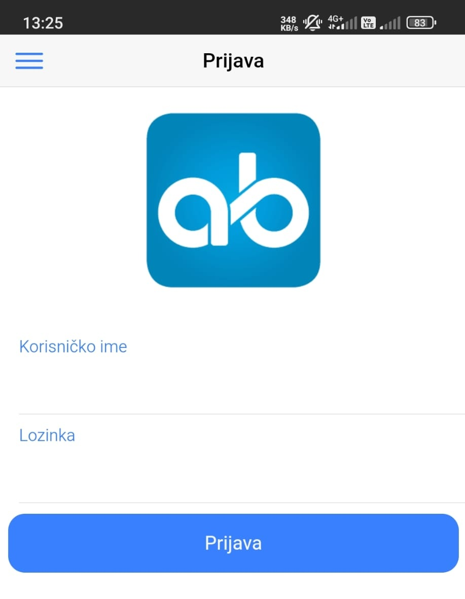
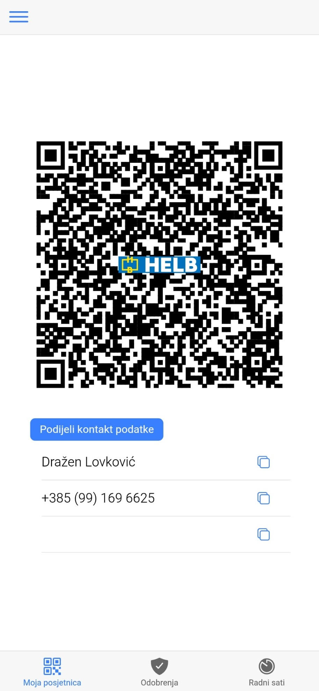
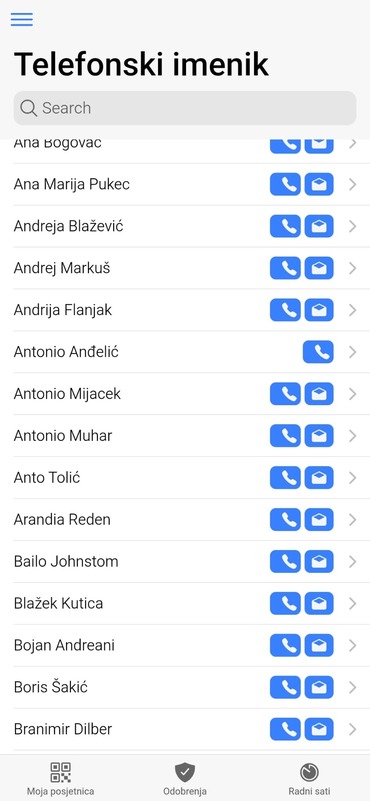
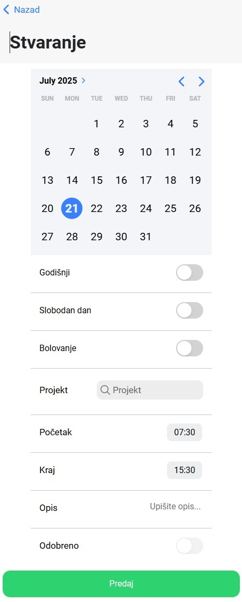
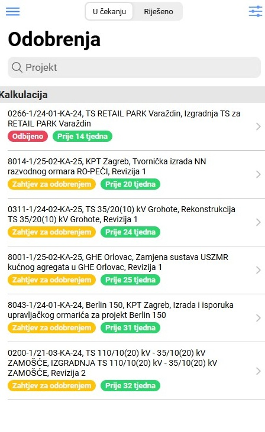
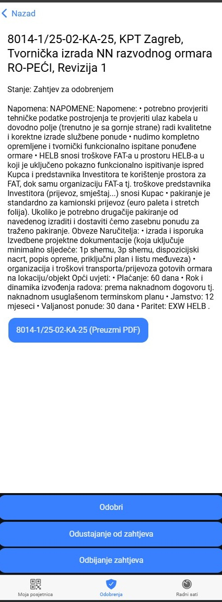

# Sučelje ERP/DMS sustava Altibiz za mobilne uređaje

**
Link za preuzimanje: <a href="https://odobravanje.helb.hr:3501/app/">https://odobravanje.helb.hr:3501/app/</a>
**  

1. **Prijava**

Ovaj ekran služi za prijavu korisnika u sustav. 
Korisnici unose svoje korisničko ime i lozinku kako bi pristupili funkcionalnostima Altibiz mobilne aplikacije.

Elementi ekrana: "Korisničko ime" i "Lozinka" za prijavu korisnika.
Primjer:  helbnet\KorisnickoIme

2. **Moja posjetnica**

"Moja posjetnica" omogućuje korisniku da generira i podijeli svoje kontakt podatke putem QR koda. To je korisno za brzu razmjenu informacija s drugim osobama.

QR kod: Sadrži kodirane kontakt podatke korisnika. Skreniranjem tog koda odmah se može spremiti kontakt  u mobitel
Prikaz kontakt podataka: Ime, prezimem telefonski broj i email. 

3. **Telefonski imenik**

"Telefonski imenik" pruža centralizirani popis kontakata unutar organizacije, omogućujući korisnicima brzo pretraživanje i pristup telefonskim brojevima i e-mail adresama kolega.

Polje za pretraživanje ("Search"): Za brzo pronalaženje kontakata po imenu ili VPN broju.
Popis kontakata: Prikazuje imena zaposlenika.
Ikone za poziv i e-mail: Omogućuju izravno pozivanje ili slanje e-maila kontaktu.
Ikona strelice (ili klik na redak/ime): Vodi na detaljniji prikaz kontakta (Br. Mobitela, VPN broj, email)
 

4. **Radni sati**

Ova funkcionalnost omogućuje zaposlenicima da evidentiraju svoje radne sate, unesu godišnji odmor, slobodne dane, bolovanje ili rad na određenom projektu.

Kalendar: odabir datuma unosa.
Prekidači (Toggle switches): "Godišnji", "Slobodan dan", "Bolovanje" za odabir vrste odsustva.
Polje "Projekt": Za unos ili odabir projekta na kojem se radilo.
Polja "Početak" i "Kraj": Za unos vremena početka i završetka rada/aktivnosti.
Polje "Opis": Za dodatni opis unosa.
Prekidač "Odobreno": Indikator statusa odobrenja unosa.
Gumb "Predaj": Za spremanje i slanje unesenih podataka.
 
5. **Odobrenja (za voditelje)**

    
    

Funkcionalnost "Odobrenja" namijenjena je voditeljima i omogućuje im pregled i upravljanje zahtjevima za odobrenje, poput radnih naloga, kalkulacija ili drugih dokumenata.
Tabovi "U čekanju" i "Riješeno": Za filtriranje zahtjeva po statusu.

Polje za pretraživanje ("Projekt"): Za pretraživanje odobrenja po projektu.
Popis zahtjeva: Prikazuje naslove zahtjeva, status (npr. "Odbijeno", "Zahtjev za odobrenjem") i vremenski okvir (npr. "Prije 13 tjedana").
Klik na zapis002FIkona strelice: Vodi na detaljniji prikaz pojedinog zahtjeva za odobrenje.
 

6. **Radni nalozi**
Ova funkcionalnost je ključna za upravljanje radnim nalozima. Omogućuje pregled, kreiranje i praćenje statusa radnih naloga.

7. **Nesukladnosti (za detalje konzultirati Nenada)**

    
    

Funkcionalnost "Nesukladnosti" služi za evidentiranje, praćenje i rješavanje svih uočenih nesukladnosti unutar poslovnih procesa.

