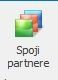
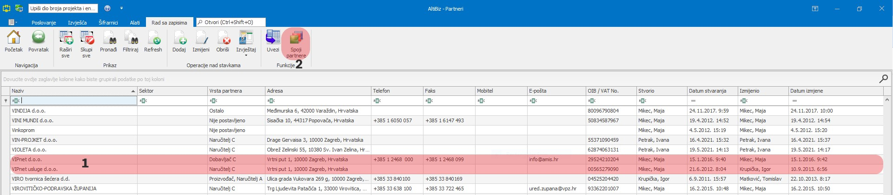
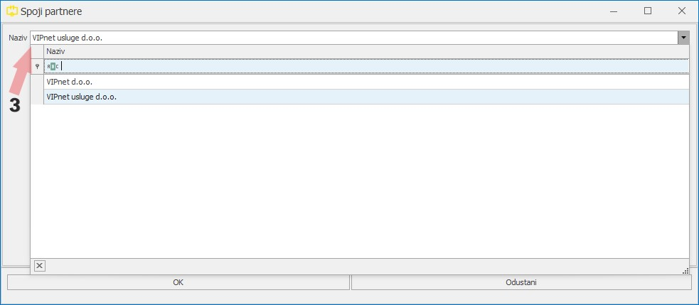

# Partneri

### 
**Unos partnera**

**
Put: Poslovanje → Resursi → Partneri**

1. **OIB/VAT No. (\*obavezno polje\*)**     
OIB koriste partneri koji su u hrvatskoj i mora sadržavati točno 11 znamenaka  
VAT No koriste strani partneri(partneri koji se nalaze izvan RH) oznaka najčešće započinje sa inicijalima države gdje je partner registriran (ATU12345678, SI12345678) ali mogu biti i samo brojčane

2. **NAZIV (\*obavezno polje\*)**   
Ispravan "Naziv partnera" se pomoću ispravnog OIBA kopira sa stranice  
Sudski registar ( https://sudreg.pravosudje.hr/registar/f?p=150:1 ) ili preko  
Obrtnog registra ( https://or.portor.hr/pretraga.htm )

3. **VRSTA PARTNERA (\*obavezno polje\*)**  
Vrstu partnera(koja se nalazi u šifarniku "Vrsta Partnera" odabiremo prema slijedećem opisu:  
Dobavljač A - Dobavljač > 500.000kn/god.  
Dobavljač B - Dobavljač > 100.000kn/god.  
Dobavljač C - Dobavljač < 100.000kn/god.  
Investitor - Investitor  
Naručitelj A - Naručitelj > 500.000kn/god.  
Naručitelj B - Naručitelj > 100.000kn/god.  
Naručitelj C - Naručitelj < 100.000kn/god.  
Neodobreno - Neodobren Dobavljač/Naručitelj/Partner/Proizvođač  
Nije postavljeno - Nije postavljeno  
Ostalo - Ostali partneri  
Partner A - Naručitelj/Dobavljač > 500.000kn/god.  
Partner B - Naručitelj/Dobavljač > 100.000kn/god.  
Partner C - Naručitelj/Dobavljač < 100.000kn/god.  
Pošiljatelj upita/Javna nabava - Pošiljatelj upita, natječaj po JN, potencijalni naručitelj  
Proizvođač - Proizvođač opreme  
Vanjski suradnik - Vanjski suradnik/kooperant (izvođenje usluga)  

4. **PROIZVOĐAČ / DOBAVLJAČ**   
Ovisno o vrsti partnera on može biti samo "Proizvođač" ili samo "Dobavljač" ali može biti i oboje   
Ako za navedenog partnera odaberemo da je on "Dobavljač" onda tog istog partnera možemo odabrati kao dobavljača u Praćenju projekta

5. **E-MAIL ADRESA ZA E-RAČUN**     
E-mail adresa koja služi za slanje e-računa i nju unosi odjel Prodaje

6. **GLAVNA ADRESA (\*obavezno polje\*)**    
Neki partneri mogu imati više adresa koje se unose u tab "Adrese" dok se glavna adresa zatim bira iz padajućeg izbornika u polju "Glavna adresa"

7. **GLAVNI TELEFON**   
Neki partneri mogu imati više telefona koji se unose u tab "Telefoni" dok se glavna telefon zatim bira iz padajućeg izbornika u polju "Glavni telefon"

8. **GLAVNA ADRESA ELEKTRONIČKE POŠTE**     
Neki partneri mogu imati više e-mail adresa koji se unose u tab "E-pošta" dok se glavna adresa elektroničke pošte zatim bira iz padajućeg izbornika u polju "Glavna adresa elektroničke pošte"

9. **GLAVNA INTERNET STRANICA**     
Internet stranica partnera ukoliko ona postoji

10. **GLAVNA KONTAKT OSOBA**        
Neki partneri mogu imati više kontakt osoba ovisno o poziciji/mjestu rada koji se unose u tab "Kontakti" dok se glavna kontakt osoba zatim bira iz padajućeg izbornika u polju "Glavna kontakt osoba"

11. **BANKOVNI RAČUNI**     
Neki partneri mogu imati račune u više različitih banaka tako da ukoliko partner ima više računa odaberemo "defaultni" račun koji se najčešće koristi  

<a href="../documents/Unos novog partnera.pdf" target="_blank">
    
    Unos novog partnera.pdf
</a>

  
- - -

### 
**Spajanje partnera**

**
Put: Poslovanje → Resursi → Partneri → Spoji partnere**  

1. Unutar izbornika Partneri selektiramo 2 partnera koje želimo spojiti u jednoga (*ctrl + S*)

2. Nakon odabira partnera koje želimo spojiti odabiremo akciju “Spoji partnere”  

      

3. Iz padajućeg izbornika izaberemo partnera koji će biti glavni tj. onog u kojeg želimo pridodati “starog” partnera i odaberemo OK

    

 * Podaci starog partnera ostaju na svim dokumentima prethodno generiranim prije spajanja partnera *

<a href="../documents/Spajanje partnera.pdf" target="_blank">
    
    Spajanje partnera.pdf
</a>

    