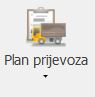

# Plan prijevoza

### 
**Plan prijevoza**  

**
Put: Poslovanje → Resursi → Plan prijevoza**  

1. **ZAHTJEVA** (\**popunjava se automatski ovisno o tome koji je korisnik prijavljen**)  

2. **DATUM ZAHTJEVA** (\**popunjava se automatski ovisno o tome koji je trenutni datum u trenutku izrade zahtjeva**)  

3. **IZMIJENIO** (\**popunjava se automatski ako sam korisnik ili neki drugi korisnik radi izmjene na prvobitnom zahtjevu**)

4. **DATUM PRIJEVOZA (\*obavezno polje\*)**      
    Iz padajućeg izbornika se odabire željeni datum za kada je potreban prijevoz

5. **PROJEKT**  
    Ako je prijevoz vezan za određeni projekt iz padajućeg izbornika se odabire odgovarajući projekt,
    ako prijevoz nije vezan za projekt onda se ostavlja prazno polje. 

    U padajućem izborniku postoje 2 taba "Moje aktivnosti" i "Projekti"

    <ins>Moje aktivnosti</ins> - prikazuje projekte na kojima se nalazi korisnik u nekim od projektnih uloga    
    <ins>Projekti</ins> - prikazuje sve projekte koji nisu arhivirani

6. **PROCJENA TRAJANJA(H)** (\**popunjava se automatski ako se popune polja "OD" i "DO"**)  

7. **VOZILO**  
    Iz padajućeg izbornika se odabire vozilo koje je potrebno za prijevoz

8. **OD (\*obavezno polje\*)**   
    Unosi se početno vrijeme prijevoza

9. **DO (\*obavezno polje\*)**   
    Unosi se završno vrijeme prijevoza
    
10. **ŠTO SE PREVOZI**  
    Unosi se sadržaj materijala/opreme koji se prevozi

11. **NAPOMENA**  
    Ako je potrebna dodatna napomena o materijalu/opremi koja se prenosi se unosi ovdje 

12. **IZVRŠENO**  
    Kada je prijevoz izvršen osoba zadužena za evidenciju označava checkbox s kvačicom, ako prijevoz nije izvršen checkbox ostaje prazan

13. **POŠALJI**  
    Označavanjem checkboxa „Pošalji“ i nakon toga akcije „Prihvati“ plan prijevoza se šalje vozaču, ako se ne želi poslati obavijest vozaču checkbox „Pošalji“ ostaje prazan

<a href="../documents/Unos plana prijevoza v1.pdf" target="_blank">
    
    Unos plana prijevoza.pdf
</a>

    