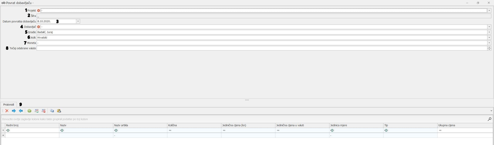

# Povrat robe dobavljaču  

### 
**Povrat robe dobavljaču**  

**
Put: Poslovanje → Nabava → Povrati Dobavljaču**   

1. **PROJEKT (\*obavezno polje\*)**     
    Iz padajućeg izbornika se odabire projekt na koji je krivo isporučen neodgovarajući materijal/oprema od onoga koji je prvobitno naručen

2. **ŠIFRA (\*automatski se generira prilikom kreiranja povrata robe dobavljaču\*)**    

3. **DATUM POVRATKA DOBAVLJAČU**        
    Odabire se datum kreiranja dokumenta povrat robe dobavljaču (PRD)

4. **DOBAVLJAČ (\*obavezno polje\*)**       
    Iz padajućeg izbornika odabire se dobavljač koji je isporučio neodgovarajući materijal/opremu

5. **IZRADIO**      
    Iz padajućeg izbornika se odabire osoba koja radi povrat robe dobavljaču 

6. **JEZIK**    
    Iz padajućeg izbornika se odabire jezik predloška (hrvatski, engleski...) ovisno o tome iz koje zemlje je dobavljač

7. **MONETA**   
    Iz padajućeg izbornika se odabire željena moneta

8. **TEČAJ ODABRANE VALUTE**    
    Unosi se tečaj za monetu koja je prethodno unesena (\*vrijedi za sve monete osim kn*) 

9. **PROIZVODI**  

    - **Redni broj** - automatski se generira ovisno o broju stavaka

    - **Naziv** - upisuje se ime materijala/opreme koja se vrača dobavljaču a ne nalazi se u katalogu

    - **Naziv artikla** - iz padajućeg izbornika se odabire materijal/oprema koja se vrača dobavljaču a nalazi se u katalogu

    - **Količina** - ukupan broj materijala/opreme koji se vrača dobavljaču

    - **Jedinična cijena(kn)** - upisuje se jedinična cijena u kunama

    - **Jedinična cijena u valuti** - upisuje se jedinična cijena u moneti koja je prethodno odabrana

    - **Jedinica mjere** - upisuje se jedinica mjere ovisno o vrsti materijala/opreme koji se vrača

    - **Tip** – jedinstvena šifra proizvođača

    - **Ukupna cijena** - popunjava se automatski tako što se množi količina artikla sa jediničnom cijenom(kn)/jediničnom cijenom u valuti  

    
    
    