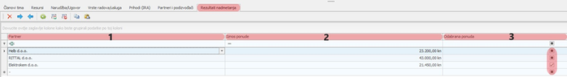
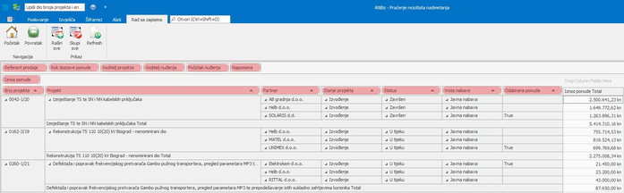

# Praćenje rezultata nadmetanja

### 
**Unos rezultata nadmetanja**

**
Put: Poslovanje → Projekt → Informacije → Rezultati nadmetanja**  

Unutar izbornika “**Informacije**” nalazi se tab “**Rezultati nadmetanja**” koji sadrži 3 kolone: **Partner**, **Iznos ponude** i **Odabrana ponuda**.

1. **Partner** - osim defaultnog partnera Helb-a iz padajućeg izbornika se odabiru ostali partneri koji su se nadmetali za taj projekt a želimo ih imati kasnije za usporedbu

2. **Iznos ponude** - upisuju se ponude ostalih ponuditelja dok se Helb-ova automatski povlači iz ponude

3. **Odabrana ponuda** - označava se ponuda koja je zadovoljila uvijete i prošla na natječaju

*Omogućen je unos i pregled ponuditelja u fazi <strong>nuđenja</strong> na svim projektima na koje se Helb prijavio*

<a href="./documents/Unos rezultata nadmetanja.pdf" target="_blank">
    
    Unos rezultata nadmetanja.pdf
</a>

  
- - -

### 
**Praćenje rezultata nadmetanja**

**
Put: Izvješća → Ponuda → Praćenje rezultata nadmetanja**  

Izvješće “Praćenje rezultata nadmetanja” omogućava pregled i analizu svih projekata(koji su prethodno uneseni) na koje se Helb prijavio u odnosu na ostale ponuditelje

Izvješće sadrži sljedeće kolone nužne za usporedbu:             

- **Broj projekta**
- **Projekt** - ime/opis projekta
- **Partner** - ostali ponuditelji koji su je uz Helb javili na natječaj
- **Stanje projekta** - razmatranje, nuđenje, izvođenje, razvoj
- **Status** - nije postavljeno, odgođen, ponuđen, u tijeku, završen
- **Vrsta nabave** - javna nabava ili nije javna nabava
- **Odabrana ponuda** - ponuda koja je zadovoljila uvijete natječaja i dobila natječaj
- **Iznos ponude** - iznosi ponuda svih unesenih partnera koji su se javili na natječaj

	

<a href="./documents/Praćenje rezultata nadmetanja.pdf" target="_blank">
    
    Praćenje rezultata nadmetanja.pdf
</a>

    