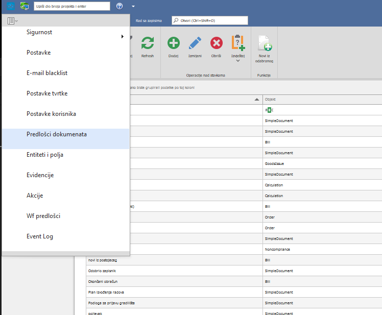
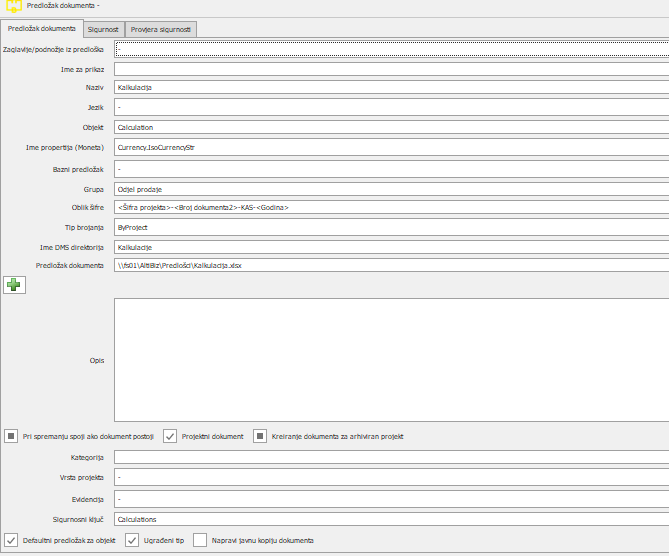
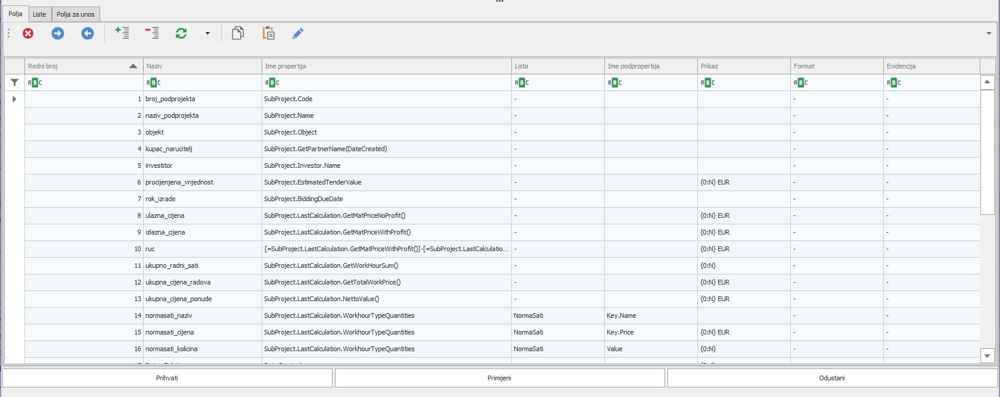
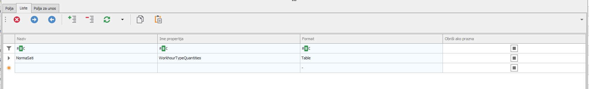
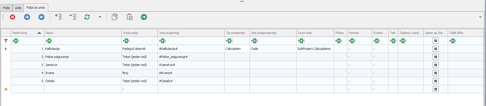

# Predlošci dokumenata

### 
**Predlošci dokumenata**  

**
Put: glavni meni -> Predlošci dokumenata**  

1. **Ime za prikaz** (\**naziv predloška koji se prikazuje**)
2. **Jezik** (\**biramo jezik ukoliko je potrebno**) 
3. **Objekt** (\**SimpleDocument ili neki drugi (Calculation, Tender, Bill)**) 
    O ovome ovisi kako se u poljima postavlja "Ime Propertija" 
4. **Ime propertija (Moneta)** (\**tu ide Currency.IsoCurrencyStr**) 
5. **Bazni predložak** 
    Ovdje se odabire neki drugi predložak sa kojeg će se povlačiti sva polje u trenutni predložak (ne kopirati) 
6. **Grupa** 
    gdje u meniu će se moći pronaći ovaj dokument za dodavanje na projekt
7. **Oblik šifre**
    kako će izgledati naziv dokumenta nakon kreiranja/spremanja
8. **Tip brojenja** 
    kako se numeriraju dokumenti - po godini, po projektu i sl.
9. **Ime DMS direktorija**
    kada se po dokumentu napravi izvještaj u koji folder na projektu će biti spremljen
10. **Predložak dokumenta** (\**ovo se popuni klikom na gumb + i odabirom fajla (predloska)**) 
    označava gdje se nalazi template za ovaj dokument - svaki put kada se generira izvjestaj taj template se koristi
11. **Opis** 
    detalji o predlošku
12. **Pri spremanju spoji ako dokument postoji** 

13. **Projektni dokument** 
    Oznacimo kako bi se pojavila opcija za dodavanje ovog dokumenta kada otvorimo/uđemo na neki projekt
14. **Kreiranje dokumenta za arhivirani projekt** 
15. **Defaultni predložak za objekt** 
16. **Ugrađeni tip** 
17. **Napravi javnu kopiju dokumenta** 
    Označavanjem ovog za svaki dokument napravljen po ovom predlošku napravit će se i javna kopija tog dokumenta u pdf-u kojoj će se moći pristupiti preko public linka
    pdf se kreira u folderu oznacenom u postavkama u "PublicFolderAddress"

### 
**Polja
**

18. **Naziv**
    Ime fielda postavljenog u templateu
19. **Ime propertija**
    Property koji se upisuje u field
20. **Lista*
    Lista koja se koristi za trenutno polje a koja je definirana u tabu Liste
21. **Ime podpropertija**
    Kad se koristi lista treba još dodatno definirati koji property od itema prikazati
22. **Prikaz**
    Ovdje se formatira text prije nego se zapise u dokument (npr. {0:N} EUR) ovo dodaje EUR nakon iznosa
23. **Format**
    Ovo moze biti Text, Paragraph, QrCode, PaymentBarCode - kada se u sustavo obraduje ovo polje na poseban nacin to radi da ubaci vrijednost 
24. **Evidencija**

### 
**Liste
**

25. **Naziv**
    Naziv liste - to odabiremo  upoljima kada biramo listu 
26. **Ime propertija*
    Sa čime se puni lista npr.  Partner.Contacts

### 
**Polja za unos
**

*Ako ovdje postoje polja tada će i svaki dokument imati prezenter i u njemu će se ručno unositi ova polja*

27. **Naziv**
    Polje iz template-a koje ce se zamijeniti sa nekom vrijednošću
28. **Vrsta polja**
    Kako će se prikazati polje u prezenteru kada se ručno unosi
29. **Tip propertija**
    Kakav je tip objekta koji se nalazi u listi (Contact, City, CatalogElement )
30. **Izvor liste**
    Ako je vrsta polja  "padajući izbornik" ovdje se bira izvor liste tj sta iude u padajući izbornik

