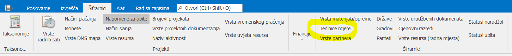
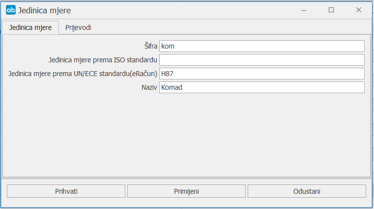
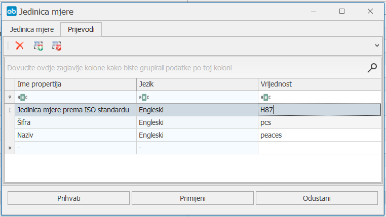

# Prijevodi

### 
**Jedinice mjere
**

**
Put: Šifrarnici → Šifrarnici → Jedinice mjere -> neki zapis (izmijeni)
**  

1. **Šifra (\*obavezno polje\*)**     
   Upisuje se šifra jedinice mjere - skraćena oznaka npr za komad - kom

2. **Jedinica mjere prema ISO standardu**  
   Upisuje se jedinica mjere prema ISO standardu

3. **Jedinica mjere prema UN/ECE standardu(eRačun) **
   Upisuje se jedinica mjere prema UN/ECE standardu

3. **Naziv (\*obavezno polje\*)**
    Upisujemo naziv jedinice mjere - primjer Komad

### 
**Prijevod jedinice mjere
**

**
Put: Šifrarnici → Šifrarnici → Jedinice mjere -> neki zapis (izmijeni) -> tab Prijevodi
**  
*(U primjeru radimo engleski prijevod za jedinicu mjere: komad)*

**Tri kolone:** 
1. **Ime propertija (\*obavezno\*)**     
    Odabire se vrijednost za koju želimo pisati prijevod npr **šifra**

2. **Jezik (\*obavezno\*)**  
    Odabiremo jezik - **engleski**

3. **Vrijednost (\*obavezno\*)**
    Upisujemo vrijednost za šifru na engleskom - **pcs**

