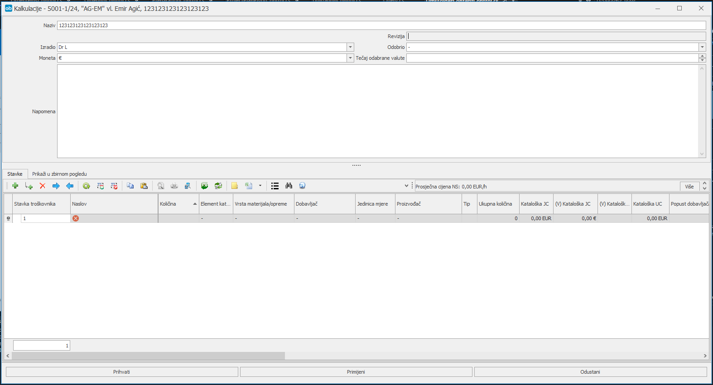

# Priprema ponude

### 
**Priprema ponude, kalkulacije i priloga ponude**

---

## Kalkulacija

**Put: Uči u projekt za koji se priprema ponuda → Dodaj → Odjel prodaje → Kalkulacija**

Kalkulaciju pripremaju VPN, te rijetko RP. Pod **Odobrio** unosi se ime i prezime osobe koja odobrava kalkulaciju, a kasnije i ponudu. Prilikom odabira monete različite od EUR, potrebno je unijeti i srednji tečaj odabirane monete (srednji tečaj HNB-a na dan kada se radi kalkulacija). Ukoliko je moneta EUR, tada je tečaj 1.

Moneta u kojoj je izrađena kalkulacija, ujedno je i moneta u kojoj će biti iskazan prilog ponude. U napomenu kalkulacije se upisuju sve interne i eksterne napomene (napomene koje će ići u ponudi).

Kalkulacija sadrži redni broj stavke, podatke o dobavljačima i proizvođačima (ako ti podaci postoje), nabavnu cijenu dobavljača, popust dobavljača (ako je primjenjivo), maržu, po potrebi dodatnu maržu i popust (ako je primjenjivo), a sve kako bi se došlo do finalne izlazne cijene kalkulacije, koja će biti iskazana prema kupcu/naručitelju. Nabavna cijena se u kalkulaciju unosi u moneti koja je dobivena od dobavljača.

Nakon unosa svih podataka, kliknuti **Primijeni** ili **Prihvati**, kako bi kalkulacija ostala sačuvana u sustavu. Nakon što kalkulacija bude odobrena, slijedi priprema ponude i priloga ponudi.

  

---

## Priprema ponude

**Put: Uči u projekt za koji se priprema ponuda → Dodaj → Odjel prodaje → Ponuda**

Potrebno unositi sve podatke koje ponuda treba sadržavati. Način plaćanja, ako nije definiran, potrebno je pregledati stare ponude i unijeti „standardni način plaćanja" koji imamo prema tom Partneru ili zajednički definirati.

Napomene često budu sadržane u napomeni kalkulacije, pa je potrebno pogledati je li VPN definirao napomene u kalkulaciji, a ako nije usmeno provjeriti postoje li napomene koje treba sadržavati ponuda.

Nakon unosa svih podataka, kliknuti **Prihvati**.

  

---

## Kreiranje obrasca ponude

**Put: Pozicionirati se na ponudu → Izvještaj**

Otvoriti će se ponuda u Word-u koju je potrebno pregledati, po potrebi urediti izgled, isprintati Word dokument. Dokument potpisuje RP i osoba koja je odobrila ponudu, a koja je odabrana u padajućem izborniku **Odobrio**.

  

---

## Priprema priloga ponude

**Put: Uči u projekt za koji se priprema ponuda → Dodaj → Odjel prodaje → Prilog ponudi**

Iz padajućeg izbornika odabrati osobu koja je odobrila prilog ponudi (PP). U tabu **Prilog ponudi** uvesti PP iz Kalkulacije.

Potrebno je obavezno provjeriti da ne postoji stavka koja mora biti prikazana u prilogu ponude, a da je skrivena. Nakon provjere i usklade podataka, kliknuti **Prihvati**.

Prilog ponudi će biti kreiran u moneti u kojoj je kreirana i kalkulacija.

  

---

## Kreiranje obrasca prilog ponude

**Put: Pozicionirati se na prilog ponudi → Izvještaj**

Otvoriti će se PP u Excelu. Potrebno je urediti zaglavlje i podnožje (obrisati vrijeme), provjeriti je li prikaz u redu, po potrebi obrisati stupce Proizvođač i Tip (ako nisu uneseni podaci), isprintati Excel dokument.

Dokument potpisuje RP i osoba koja je odobrila ponudu, a koja je odabrana u padajućem izborniku **Odobrio**.

Sken obostrano potpisane ponude dostavlja se kupcu putem e-maila, te se poslani mail sprema u DMS:  
**Put: Uči u projekt → TAB Datoteke → Ponuda**

**Prije bilo kakve promjene u dokumentima (kalkulacija, ponuda, prilog ponudi), potrebno je napraviti reviziju istih, kako bi u sustavu ostale sve prethodno spremljene verzije.**

    
