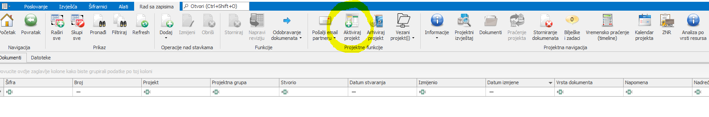
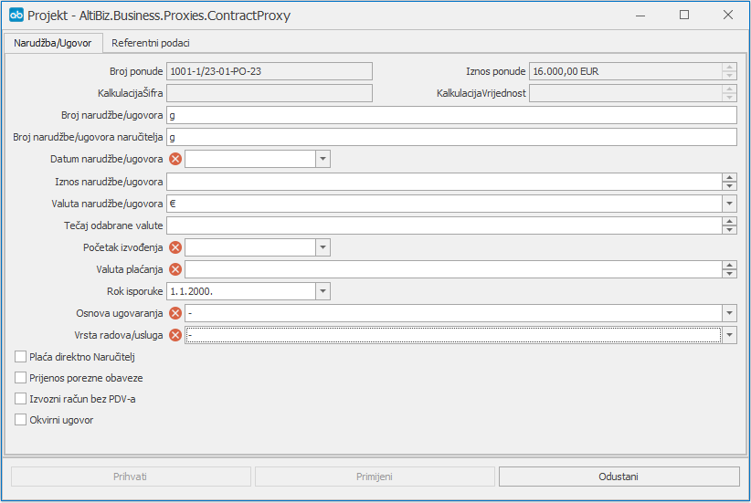

# Projekti

### 
**Aktiviranje projekta**

**
Put: Neki projekt → Projektne funkcije → Aktiviraj projekt**  

Aktiviranje projekta se odvija prema sljedećim uputama:

1. **Broj narudžbe/ugovora (\*obavezno polje\*)**     
    Unosi se broj narudžbe/ugovora

2. **Broj narudžbe/ugovora naručitelja**  
    Unosi se broj narudžbe/ugovora naručitelja

3. **Datum narudžbe/ugovora (\*obavezno polje\*)**
    Unosi se datum narudžbe/ugovora

4. **Iznos narudžbe/ugovora**  
    Unosi se iznos narudžbe/ugovora

5. **Valuta narudžbe/ugovora**  
    Odabire se valuta narudžbe/ugovora 

6. **Tečaj odabrane valute**  
    Unosi se tečaj odabrane valute

7. **Početak izvođenja (\*obavezno polje\*)**   
    Odabire se datum početka izvođenja projekta 

8. **Valuta plaćanja (\*obavezno polje\*)**   
    Unosi se valuta plaćanja

9. **Rok isporuke** 
    Odabire se rok isporuke  

10. **Osnova ugovaranja (\*obavezno polje\*)**   
    Odabire se osnova ugovaranja iz padajućeg menia

11. **Vrsta radova/usluga (\*obavezno polje\*)**   
    Odabire se vrsta radova/usluga 

12. **Neobavezna polja za označiti ili ne: **
Plaća direktno naručitelj, Prijenos porezne obaveze, Izvozni račun bez PDV-a i Okvirni ugovor

    