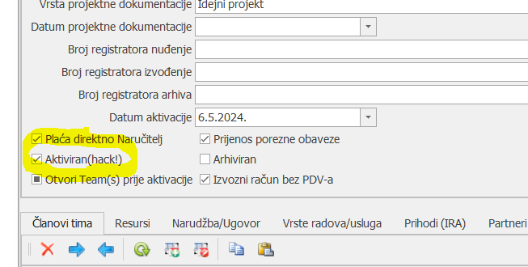
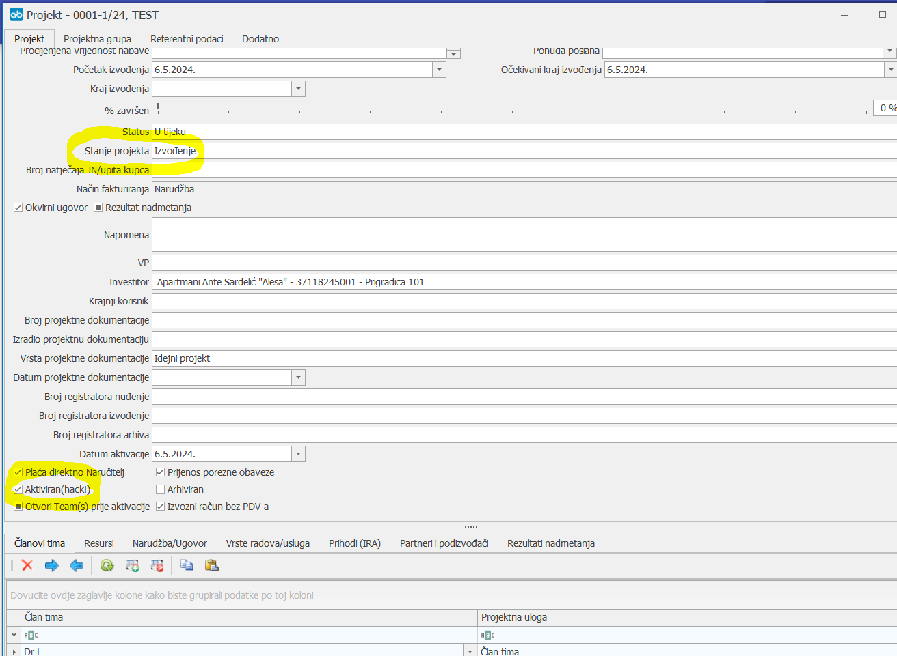

# Projekti

### 
**Aktiviranje projekta
**

**
Put: Neki projekt(U nuđenju) → Projektne funkcije → Aktiviraj projekt
**  

 Prije aktivacije projekta, potrebno je provjeriti tko će biti VP i eventualno drugi članovi na projektu, T. Horvat obavezno mora biti dodijeljen kao član tima na svakom projektu koji se aktivira, te ih je u informacijama projekta potrebno unijeti u TAB Članovi tima, kako bi svi članovi dobili e-mail obavijest da je projekt aktiviran.Prilikom aktivacije projekta svaki projekt bi trebao imati kreiranu kalkulaciju i ponudu. Prije same aktivacije projekta, potrebno je s voditeljem projekta nuđenja (VPN) provjeriti jesu li u kalkulaciju upisani svi proizvođači, dobavljači, tipovi i cijene kako bi voditelji projekta (VP) nakon aktivacije mogli krenuti u naručivanje opreme i materijala.

1. **Broj ponude**(\*ne unosi korisnik\*  )
    Ukoliko na projektu postoji dokument ponuda automatski se povlači njezin broj.

2. **Iznos ponude**(\*ne unosi korisnik\*  )
    Ukoliko na projektu postoji dokument ponuda, automatski se u ovo polje povlači njezin iznos, ukoliko se iznos ne povlači potrebno je na projektu napraviti ponudu prije same aktivacije projekta.

3. **KalkulacijaŠifra**(\*ne unosi korisnik\*  )
    Ukoliko na projektu postoji dokument kalkulacija, automatski se u ovo polje povlači njezin broj, ukoliko se šifra kalkulacije ne povlači potrebno je na projektu napraviti kalkulaciju prije same aktivacije projekta.

4. **KalkulacijaVrijednost**(\*ne unosi korisnik\*  )
    Ukoliko na projektu postoji dokument kalkulacija automatski se povlači njezin iznos, ukoliko se iznos ne povlači potrebno je na projektu napraviti kalkulaciju prije same aktivacije projekta. 

5. **Broj narudžbe/ugovora (\*obavezno polje\*)**     
    HELB-ov interni broj narudžbe/ugovora. Primjer: za projekt 0139-1/21 broj narudžbe/ugovora će biti 0139-1/21-01-UG-21. Ako sustav automatski povuče broj 0139-1/21-01.X (bilo koji broj)-UG-21, interni broj je potrebno ručno izmijeniti u 0139-1/21-01-UG-21.

6. **Broj narudžbe/ugovora naručitelja**  
    Broj narudžbe/ugovora koji je upisan na dokumentu koji je dobiven od strane naručitelja/kupca (dokument se sprema u DMS (folder Narudžba naručitelja/Ugovor).

7. **Datum narudžbe/ugovora (\*obavezno polje\*)**
    Datum izdavanja narudžbe ili datum potpisa ugovora od strane ovlaštenih predstavnika s datumom zadnjeg potpisa.

8. **Iznos narudžbe/ugovora**  
    Iznos narudžbe ili ugovora u moneti u kojoj je definiran iznos narudžba/ugovora. Ukoliko je moneta različita od EUR potrebno je kroz reviziju kalkulacije i ponude pripremiti dokumente koji su izraženi u moneti u kojoj je stigla narudžba/ugovor prije same aktivacije projekta.

    **
 Iznos ponude, KalkulacijaVrijednost i Iznos narudžbe/ugovora trebaju biti usklađeni, odnosno sve vrijednosti trebaju biti jednake prije aktivacije. Ukoliko to nije slučaj potrebno je kroz revizije dokumenata uskladiti stavke, odnosno vrijednosti.
**

9. **Valuta narudžbe/ugovora**  
    Moneta u kojoj je izražena narudžba (EUR, USD…). Ukoliko je moneta različita od EUR, automatski se u ovo polje povlači moneta koja je upisana u dokumentu ponuda.

10. **Tečaj odabrane valute**  
    Ukoliko je moneta različita od EUR, automatski se u ovo polje povlači tečaj koji je upisan u dokumentu ponuda.

11. **Početak izvođenja (\*obavezno polje\*)**   
    Iz kalendara se odabire datum početka radova na projektu, najčešće je to datum/dan aktivacije projekta, osim ako drugačije nije definirano

12. **Valuta plaćanja (\*obavezno polje\*)**   
    Valuta plaćanja računa (30, 60, 90, 120… dana)

13. **Rok isporuke** 
    Iz kalendara se odabire datum isporuke koji je navedena na narudžbi ili rok realizacije koji je naveden u tekstu ugovora.  

14. **Osnova ugovaranja (\*obavezno polje\*)**   
    Iz padajućeg izbornika se odabire:
        1. Narudžba – ukoliko je projekt aktiviran na temelju dobivene narudžbe/dispozicije
        2. Ugovor s jednokratnim računom – ukoliko je projekt aktiviran na temelju ugovora čije će se plaćanje vršiti jednokratno, po završetku/realizaciji cjelokupnog predmeta ugovora
        3. Ugovor s mjesečnim situacijama – ukoliko je projekt aktiviran na temelju ugovora čiji će se plaćanje vršiti temeljnih mjesečnih situacija, a po završetku/realizaciji cjelokupnog predmeta ugovora biti će izdana okončana situacija
        4. Okvirni sporazum / Godišnji ugovor - ukoliko je projekt aktiviran na temelju okvirnog ugovora/okvirnog sporazuma/godišnjih ugovora čije će se plaćanje vršiti temeljemmjesečnih/kvartalnih/polugodišnjih situacija

15. **Vrsta radova/usluga (\*obavezno polje\*)**   
    Iz padajućeg izbornika se odabire glavna/primarna vrsta radova/usluga na projektu.

16. **Neobavezna polja za označiti ili ne:**
    U slučajevima kada je narudžba/ugovor pristigao od partnera prema kojemu će se izdavati računi, a plaćanje navedenih računa će vršiti direktno naručitelj (partner različit od onog prema kojem su računi izdani) tada se ovo polje označuje kvačicom. Takva praksa se gotovo uvijek primjenjuje u slučajevima kada je HELB nominirani podizvoditelj u postupcima javne nabave (ovakav način plaćanja je definiran ZJN 120/16). U informacijama projekta je obavezno provjeriti jesu li upisani ispravni podaci o Investitoru i Krajnjem korisniku

17. **Prijenos porezne obveze (tuzemno)**
    U slučajevima kada se na narudžbu/ugovor ne primjenjuje obračun PDV-a, već prijenos porezne obveze (PPO) tada se ovo polje označuje kvačicom (rekonstrukcije, izgradnja novog postrojenja i dr.). Prilikom aktivacije projekta potrebno je s Naručiteljem provjeriti primjenjuje li se PPO ili ide obračun PDV-a. Dobivena informacija se upisuje pod napomenu projekta, a mail potvrde/odgovora dobiven od Naručitelja se sprema u DMS (folder Narudžba naručitelja ili Ugovor).

18. **Izvozni račun bez PDV-a**
    Ukoliko je riječ o izvozu ili inozemnoj isporuci koja je oslobođena PDV-a ili ne podliježe oporezivanju tada se ovo polje označuje kvačicom. 

19. **Okvirni ugovor**
    Ukoliko je projekt aktiviran na temelju okvirnog ugovora ili sporazuma temeljem kojeg će biti izdane zasebne narudžbe/dispozicije, a na temelju kojih će se vršiti realizacija projekta tada se ovo polje označuje kvačicom, kako se u izvještajima ne bi duplirali iznosi okvirnog ugovora i narudžbi.

 Prilikom aktivacije projekta, kalkulacija se kopira u praćenje projekta, na temelju kojeg VP vrši narudžbu opreme, materijala, usluga, planira resurse i dr. 

 U slučaju da dođe do revizije narudžbe, aneksa i sl., podaci se ažuriraju u informacijama projekta, PUT: Uči u projekt za koji se priprema ponuda -> Informacije -> TAB Narudžba/Ugovor. Podatke ažuriraju RP.

  

## 
**Unos kontakta
**

Nakon aktivacije projekta (ili prije, ako raspolažemo podacima) potrebno je u imformacijama o projektu iz padajućeg izbornika odabrati kontakt osobu.
Ako u izborniku osoba ne postoji, treba dodati novi Kontakt (kontakt podaci o odgovornoj osobi za realizaciju projekta od strane kupca/naručitelja): 
PUT: Ući u projekt za koji se unose podaci-> TAB Projekt -> polje „Kontakt“ -> + (obavezno koristiti +, prilikom unosa novih podataka, odnosno postojeći kontakti se ne smiju mijenjati)

Internet stranica, e-mail adresa, adresa i telefon se upisuje u niže TAB-ove i nakon toga odabire u drop 
down listi./

 Nakon aktivacije projekta, kupcu/naručitelju je potrebno e-mailom poslati Potvrdu narudžbe: PUT: Uči u projekt za koji se priprema ponuda -> Dodaj -> Odjel prodaje -> Potvrda narudžbe -> Pozicionirati se na potvrdu narudžbe -> Izvještaj. Word dokument se printa, potpisuje i e-mailom vraća kupcu/naručitelju, a e-mail o poslanoj potvrdi se sprema u DMS u pripadajući foldre

  

## 
**Deaktivacija projekta – iznimno
**

**
Put: Projekt → Informacije
**

### 
Deaktivacija projekta pomoću micanja kvačice, te vraćanja nazad nakon promjena

Koristi se ukoliko nema potrebe za ponovnim kopiranjem stavaka iz kalkulacije u pripremu, za izmjenu informacija o projektu

1. **Kučica Aktivan (\*obavezno\*)**     
    Maknuti kvačicu sa kućice Aktivan(hack!)

2. **Spremiti izmjene**

3. **Sada je moguće mijenjati informacije na projektu zbog čega je i deaktiviran**

4. **ukoli./stavke iz pripreme nisu mijenjane, projekt se aktivira tako da se samo postavi kvačica na kućicu Aktivan(hack!)**

5. **Spremiti izmjene**

### 
Deaktivacija projekta pomoću micanja kvačice, aktivacija kroz ikonu „Aktiviraj projekt“

Koristi se ukoliko je potrebno ponovo kopirati stavke kalkulacije u pripremu

1. **Stanje projekta (\*obavezno polje\*)**     
    Promijenimo stanje projekta u "Nuđenje"

2. **Kučica Aktivan (\*obavezno\*)**     
    Maknuti kvačicu sa kućice Aktivan(hack!)

3. **OPCIO./NO** - pobrisati sve stavke iz pripreme, zatim spremiti izmjene

4. **Spremiti izmjene**

5. **Sada ./moguće mijenjati određene informacije na projektu**

6. **Projekt ponovo aktiviramo pomoću gumba "Aktiviraj projekt"** (rad sa zapisima -> projektne funkcije - aktiviraj projekt) – čime se stavke iz kalkulacije kopiraju u pripremu (ako nisu pobrisane prije toga, biti će duple!!)

    