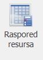
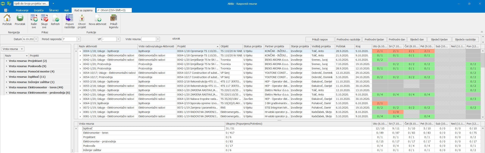
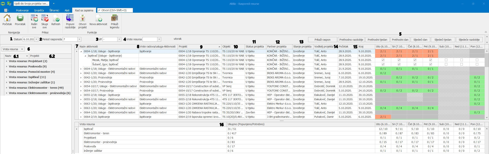

# Raspored resursa

### 
**Raspored resursa**

[//]: # "align picture to center"

**
Put: Poslovanje → Resursi → Raspored resursa
** 

1. Polje "**Datum**" služi za odabir početnog datuma početka željene aktivnosti, nakon toga pritisnemo gumb "Prikaži raspon" i ovisno o odabranom "**Periodu rasporeda**" na gornjoj desnoj strani ekrana nam se prikazuje odabrani period

2. Polje "**Period rasporeda**" nudi prikaz trajanja aktivnosti koji može biti 7, 14, 21 ili 28 dana

3. Polje "**VP**" nudi odabir voditelja projekta čije aktivnosti želimo vidjeti

4. Polje "**Vrsta resursa**" nudi odabir prikaza vrste resursa/ljudi koji su nam u tom trenutku potrebni

5. Funkcije vremenskih polja    
    - Prethodno razdoblje – vraća vremenski period unatrag za odabrani "**Period rasporeda**"
    - Prethodni tjedan - vraća vremenski period unazad u trajanju od 7 dana
    - Prethodni dan - vraća vremenski unazad za 1 dan
    - Sljedeći dan – postavlja vremenski period sa tekućeg/trenutnog na slijedeći dan
    - Sljedeći tjedan – pomiče vremenski period unaprijed u trajanju od 7 dana 
    - Sljedeće razdoblje - pomiče vremenski period unaprijed za odabrani "**Period rasporeda**"

6. U gridu "**Vrsta resursa**" imamo pregled  naziva/imena samih resursa koje dodjeljujemo na željenu aktivnost i  broj projekta na koji je taj resurs dodijeljen

    
 * ako se isti resurs dodijeli na 2 različita projekta koji su planirani u istom vremenskom periodu korisnik će dobiti obavijest o tome a sam resurs će biti označen crvenom bojom *

    
 * svaku aktivnost je moguće dodati resurs koji nije direktno povezan sa planiranom vrstom radova/usluga definiranom na samoj aktivnosti *

7. Stupac "**Naziv aktivnosti**" prikazuje sve aktivnosti koje se nalaze u odabranom vremenskom periodu "Period rasporeda"

8. Stupac "**Vrste radova/usluga-Aktivnosti**" nudi pregled vrsta radova/usluga koje je prethodno unio odjel prodaje u kalkulaciju

9. Stupac "**Projekt**" prikazuje broj i ime projekta na kojemu su dodane aktivnosti i vrste resursa

10. Stupac "**Objekt**" prikazuje ime objekta koji se nalazi na projektu 

11. Stupac "**Status projekta**" prikazuje u kojem se trenutačno statusu nalazi projekt( u tijeku, završen, odgođen, prekinuto, ponuđen)

12. Stupac "**Partner projekta**" prikazuje ime investitora/naručitelja na projektu

13. Stupac "**Stanje projekta**" prikazuje u kojem se projekt trenutno nalazi stanju (nuđenje ili izvođenje)

14. Stupac "**Voditelj projekta**" prikazuje osobu koja je zadužena za vođenje određenog projekta

15. Stupci "**Početak**" i "**Kraj**" označuju početni i završni dio planirane aktivnosti na projektu

16. U donjem gridu se nalaze stupci "**Vrsta resursa**" i "**Ukupno(Popunjeno/Potrebno)**" koji nam pokazuju koliko je od planiranih resursa dostupno/iskorišteno u odabranom "**Vremenskom periodu**“

<a href="../documents/Raspored resursa(bez oznaka).pdf" target="_blank">
    
    Raspored resursa(bez oznaka).pdf
</a>

  
- - -

### 
**Raspored resursa(sa oznakama)**

**
Put: Poslovanje → Resursi → Raspored resursa**

1. Polje (**1**) "Datum" služi za odabir početnog datuma početka željene aktivnosti, nakon toga pritisnemo gumb "Prikaži raspon" i ovisno o odabranom (**2**) "Periodu rasporeda" na gornjoj desnoj strani ekrana nam se prikazuje odabrani period

2. Polje (**2**) "Period rasporeda" nudi prikaz trajanja aktivnosti koji može biti 7, 14, 21 ili 28 dana

3. Polje (**3**) "VP" nudi odabir voditelja projekta čije aktivnosti želimo vidjeti

4. Polje (**4**) "Vrsta resursa" nudi odabir prikaza vrste resursa/ljudi koji su nam u tom trenutku potrebni

5. Funkcije vremenskih polja (**5**)
    - Prethodno razdoblje – vraća vremenski period unatrag za odabrani (**2**) "Period rasporeda"
    - Prethodni tjedan - vraća vremenski period unazad u trajanju od 7 dana
    - Prethodni dan - vraća vremenski unazad za 1 dan
    - Sljedeći dan – postavlja vremenski period sa tekućeg/trenutnog na slijedeći dan
    - Sljedeći tjedan – pomiče vremenski period unaprijed u trajanju od 7 dana
    - Sljedeće razdoblje - pomiče vremenski period unaprijed za odabrani (**2**) "Period rasporeda"

6. U gridu(**6**) "Vrsta resursa" imamo pregled (**6.1**) naziva/imena samih resursa koje dodjeljujemo na željenu aktivnost i (**6.2**) broj projekta na koji je taj resurs dodijeljen

    
 * ako se isti resurs dodijeli na 2 različita projekta koji su planirani u istom vremenskom periodu korisnik će dobiti obavijest o tome a sam resurs će biti označen crvenom bojom *
  

    
 * svaku aktivnost je moguće dodati resurs koji nije direktno povezan sa planiranom vrstom radova/usluga definiranom na samoj aktivnosti *
  

7. Stupac(**7**) "Naziv aktivnosti" prikazuje sve aktivnosti koje se nalaze u odabranom vremenskom periodu (**2**) "Period rasporeda"

8. Stupac(**8**) "Vrste radova/usluga-Aktivnosti" nudi pregled vrsta radova/usluga koje je prethodno unio odjel prodaje u kalkulaciju

9. Stupac (**9**) "Projekt" prikazuje broj i ime projekta na kojemu su dodane aktivnosti i vrste resursa

10. Stupac (**10**) "Objekt" prikazuje ime objekta koji se nalazi na projektu

11. Stupac (**11**) "Status projekta" prikazuje u kojem se trenutačno statusu nalazi projekt( u tijeku, završen, odgođen, prekinuto, ponuđen)

12. Stupac (**12**) "Partner projekta" prikazuje ime investitora/naručitelja na projektu

13. Stupac (**13**) "Stanje projekta" prikazuje u kojem se projekt trenutno nalazi stanju (nuđenje ili izvođenje)

14. Stupac (**14**) "Voditelj projekta" prikazuje osobu koja je zadužena za vođenje određenog projekta

15. Stupci (**15**) "Početak" i "Kraj" označuju početni i završni dio planirane aktivnosti na projektu

16. U donjem gridu se nalaze stupci (**16**) "Vrsta resursa" i "Ukupno(Popunjeno/Potrebno)" koji nam pokazuju koliko je od planiranih resursa dostupno/iskorišteno u odabranom (**2**) "Vremenskom periodu"

 
<a href="../documents/Raspored resursa(sa oznakama).pdf" target="_blank">
    
    Raspored resursa(sa oznakama).pdf
</a>

    