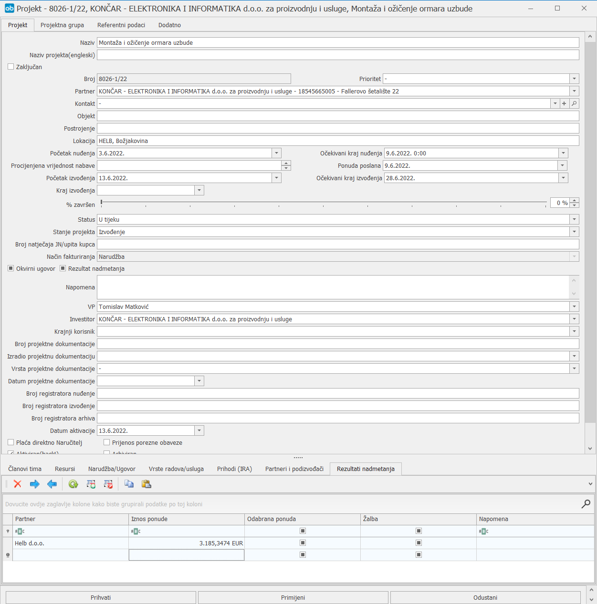
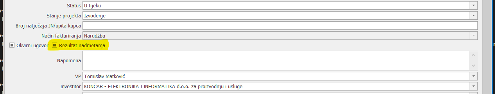

# Rezultati nadmetanja

### 
**Rezultati nadmetanja**

**
Put: Neki projekt -> Informacije o projektu -> Rezultati nadmetanja (tab)**  

Unutar prozora “Informacije o projektu” nalazi se tab “Rezultati nadmetanja” koji sadrži 5 kolona: Partner, Iznos ponude, Odabrana ponuda, Žalba i Napomena. 
Podaci o ponudama se unose odmah po objavi Zapisnika s otvaranja ponuda, dok se Odabrana ponuda označava odmah po primitku Odluke o odabiru.

1. **Partner  (\*obavezno polje\*)**     
     Osim defaultnog partnera HELB-a iz padajućeg izbornika ili slobodnim unosom (za partnere koje nemamo ni listi Partnera) se odabiru ostali ponuditelji koji su se nadmetali za taj projekt, a želimo ih imati kasnije za usporedbu

2. **Iznos ponude**
    Upisuju se iznosi ponuda (bez PDV-a) ostalih ponuditelja, dok se HELB-ova automatski povlači iz ponude

3. **Odabrana ponuda**                 
    Odmah po objavi Odluke o odabiru, označava se ponuda koja je zadovoljila uvijete i prošla na natječaju *više ponuda može biti odabrano istovremeno, u slučaju da je HELB podizvoditelji na nekom postupku ili ako se npr. na natječaj javlja zajednica ponuditelja

4. **Žalbe**    
    U slučaju žalbe od strane HELB-a ili nekog drugog ponuditelja označava se navedeni checkbox

5. **Napomena**    
    Upisuju se napomene vezane uz ponude (npr. ponuda X ponuditelja je odbijena, jedina ponuda i sl.)

 Kako bi se rezultati nadmetanja mogli pratiti u izvješću Praćenje rezultata nadmetanja potrebno je u informacijama o projektu označiti checkbox Rezultati nadmetanja

