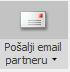
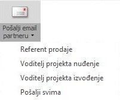

# Slanje maila iz Altibiza

### 
**Slanje maila iz Altibiza (projekta)**  

**
Put: Poslovanje → Projekti/Moji Projekti → Projektne funkcije → Pošalji email partneru
** 

   1. Slanje maila kroz projekte je omogućeno klikom na ikonu "**Pošalji email partneru**"
      
      
      
\*klikom na gornji dio ikone šalje se mail glavnom partneru na projektu(ako je isti dodijeljen)*

       

   2. Akcija "Pošalji email partneru" vam tada ovisno o članovima tima koji su prethodno dodijeljeni na određeni projekt nudi slanje maila prema projektnim ulogama koje su dodijeljene članovima tima ovisno o njihovoj funkciji na tom projektu

      
      
\*članovi tima na svakom projektu mogu imati drugačiju projektnu ulogu*

       

   3. Ovisno o tome koju smo projektnu ulogu odabrali otvara nam se defaultni program za slanje maila sa e-mail adresom člana tima koji se nalazi iza odabrane projektne uloge.

<a href="../documents/Slanje maila iz Altibiza(projekta).pdf" target="_blank">
    
    Slanje maila iz Altibiza(projekta).pdf
</a>

    