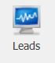

# Unos Leada/prilike

### 
**Unos Leada/prilike**

**
Put: Poslovanje → Prodaja → Leads**  

Unos nove prilike/leada se odvija prema sljedećim kriterijima:

1. **NAZIV  (\*obavezno polje\*)**     
    Unosi se naziv moguće prilike/leada

2. **PROJEKT**  
    Ako se moguća prilika/lead veže na već postojeći projekt, isti se bira iz padajućeg izbornika. Ako se ne veže niti na jedan projekt, polje se ostavlja prazno.

3. **OBJEKT**   
    Unosi se ime objekta na kojemu će se odvijati mogući radovi

4. **INTERNI KONTAKT  (\*obavezno polje\*)**    
    Odabire se interni kontakt koji je došao do moguće prilike/leada

5. **REFERENT PRODAJE  (\*obavezno polje\*)**    
    Odabire se referent prodaje koji će biti zadužen za kreiranje ponude

6. **DATUM ZADNJEG KONTAKTA**    
    Odabire se datum kada je ostvaren zadnji kontakt vezan za moguću priliku/lead

7. **DATUM SLJEDEĆEG KONTAKTA**    
    Odabire se sljedeći datum kontakta vezan za moguću priliku/lead

8. **UKUPNI BUDŽET**    
    Unosi se vrijednost/ukupni budžet moguće prilike/leada

9. **UKUPNI BUDŽET U VALUTI**    
    Unosi se vrijednost/ukupni budžet u stranim valutama moguće prilike/leada

10. **PROCIJENJENA VRIJEDNOST PRILIKE**    
    Unosi se procijenjena vrijednost prilike iz kalkulacije u odnosu na ukupni budžet

11. **VJEROJATNOST UGOVARANJA**    
    Odabire se jedna od 3 moguće opcije:
    - Vjerojatnost ugovaranja manja od 50% 
    - Vjerojatnost ugovaranja od 60% do 80% 
    - Vjerojatnost ugovaranja 100%

    \* ako je vjerojatnost ugovaranja 100%, potrebno je stvoriti projekt za tu priliku/lead *

12. **MONETA**    
    Odabire se moneta budžet

13. **TEČAJ ODABRANE VALUTE**    
    Odabire se tečaj za odabranu monetu

14. **PARTNER**    
    Odabire se partner za projekt, ako je isti potreban

15. **KONTAKT PARTNERA (\*obavezno polje\*)**    
    Ako je odabran partner unosi se kontakt broj odabranog partnera

16. **STANJE PRILIKE**    
    Odabire se jedna od 4 moguće opcije: 
    - Prvi kontakt
    - Pregovori
    - Ugovoreno
    - Nije ugovoreno

    