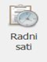
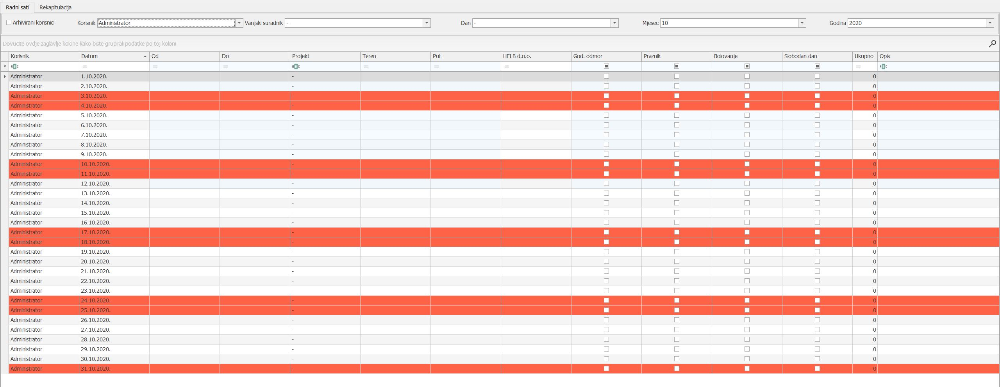

# Unos radnih sati

### 
**Unos radnih sati**  

**
Put: Poslovanje → Resursi → Radni sati**  

1. **KORISNIK** (\**automatski se prikazuje korisnik koji je trenutno logiran**)  

2. **DATUM** (\**automatski je popunjen za sve dane u mjesecu tijekom cijele godine**)  
    
\*crvena boja u redovima prikazuje subote i nedjelje u tom mjesecu\*

3. **OD (\*obavezno polje\*)**   
    Unosi se početno radno vrijeme za odabrani dan

4. **DO (\*obavezno polje\*)**   
    Unosi se završno radno vrijeme za odabrani dan
    
5. **PROJEKT (\*obavezno polje\*)**     
    Iz padajućeg izbornika se odabire broj projekta na koji se odnosi radno vrijeme, padajućem izborniku postoje 2 taba "Moje aktivnosti" i "Projekti"

    <ins>Moje aktivnosti</ins> - prikazuje projekte na kojima se nalazi korisnik u nekim od projektnih uloga    
    <ins>Projekti</ins> - prikazuje sve projekte koji su trenutno aktivni
    
6. **TEREN**        
    Unosi se broj sati proveden na terenu od ukupnog broja sati za taj dan

7. **PUT**      
    Unosi se broj sati proveden na putu od ukupnog broja sati za taj dan

8. **HELB d.o.o.** (\**automatski prikazuje broj sati**)  

9. **GODIŠNJI ODMOR**  
    U "checkbox" se unose dani koje korisnik koristi u svrhu godišnjeg odmora

10. **PRAZNIK** (\**automatski se popunjava na razini tvrtke za tekuću godinu**)

11. **BOLOVANJE**  
    U "checkbox" se unose dani koje korisnik koristi u svrhu bolovanja

12. **SLOBODNI DAN**  
    U "checkbox" se unose dani koje korisnik koristi u svrhu iskorištenja slobodnih dana

13. **UKUPNO**  
    Prikazuje ukupnu sumu sati za taj dan

14. **OPIS**    
    U ovo se polje upisuju dodatne napomene za odabrani projekt koje mogu kasnije koristiti korisniku kao podsjetnik

<a href="../documents/Pravilan unos radnih sati.pdf" target="_blank">
    
    Pravilan unos radnih sati.pdf
</a>

    