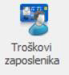

# Unos troškova zaposlenika

### 
**Unos troškova zaposlenika**  

**
Put: Poslovanje → Financije → Troškovi zaposlenika**  

Nakon ulaska u izbornik prikazan je trenutni korisnik koji ima mogućnost pregleda svih svojih troškova koje je isti unio kroz ovaj izbornik 

*mogućnost sortiranja troškova korisnika po danu, tjednu, mjesecu i godini*

Unos novog troška se odvija prema slijedećim kriterijima:

**1. DATUM (\*obavezno polje\*)**   
Unos datuma kada se trošak dogodio

**2. PROJEKT**    
Ako je trošak vezan na neki postojeći projekt onda se iz padajućeg izbornika odabere željeni projekt , ako trošak nije vezan za projekt to polje se ostavi prazno 

*U padajućem izborniku projekt postoje dva taba, „Moje aktivnosti“ gdje se prikazuju projekti na koje je korisnik dodan kao član tima i „Projekti“ gdje su vidljivi svi aktivni projekti gdje korisnik nije dodan kao član tima*

**3. VRSTA TROŠKA (\*obavezno polje\*)**    
Unos vrste „plaćanja“ kojim je navedeni trošak bio podmiren

**4. PRUŽATELJ USLUGE / MJESTO KUPNJE (\*obavezno polje\*)**  
Iz padajućeg izbornika odaberemo pružatelja usluge ili mjesto kupnje gdje je napravljen trošak 

*ukoliko pružatelj usluge ili mjesto kupnje nisu već prethodno uneseni potrebno ih je unijeti kroz izbornik „Partneri“*

**5. VRSTA USLUGE**     
Odabir usluge pri kojoj je nastao navedeni trošak

**6. OPIS USLUGE**      
Proizvoljni opis usluge ako je potrebno dodatno obrazloženje

**7. REGISTARSKA OZNAKA VOZILA**      
Ukoliko je trošak nastao kao posljedica punjenja vozila potrebno je odabrati registarsku oznaku vozila koje je bilo punjeno tom prilikom

**8. PLAĆENO U VALUTI (\*obavezno polje\*)**    
Unos točnog iznosa troška koji nastao prilikom plaćanja  

**9. MONETA**     
Odabir monete koja je korištena prilikom plaćanja troška (\*kn , eur , usd , gbp…*)

**10. TEČAJ ODABRANE VALUTE**     
Ukoliko je trošak plaćen u moneti koja nije kn , potrebno je unijeti tečaj za odabranu monetu  

*Tečaj se može provjeriti na stranici https://www.hnb.hr/temeljne-funkcije/monetarna-politika/tecajna-lista/tecajna-lista*

<a href="../documents/Pravilan unos troškova zaposlenika.pdf" target="_blank">
    
    Pravilan unos troškova zaposlenika.pdf
</a>

    