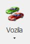
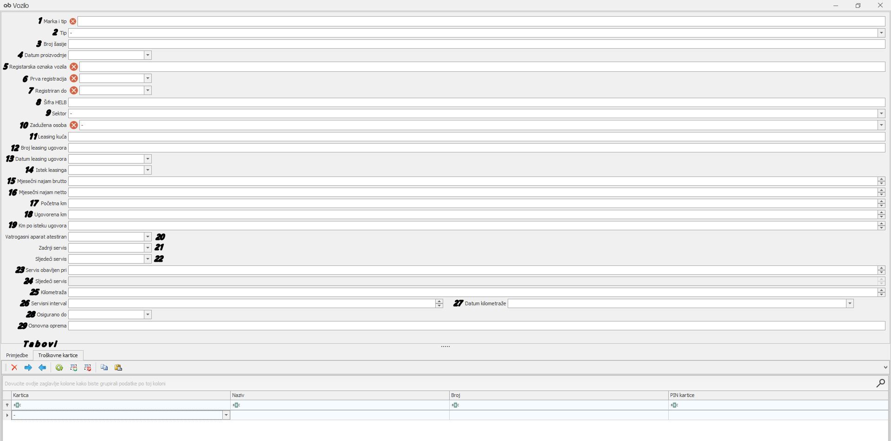
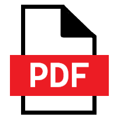

# Unos vozila

### 
**Unos vozila**  

**
Put: Poslovanje → Resursi → Vozila**  

1. **MARKA I TIP VOZILA (\*obavezno polje\*)**      
    Unosi se marka i ime vozila

2. **TIP**      
    Iz padajućeg izbornika se odabire da li se radi o osobnom ili teretnom vozilu

3. **BROJ ŠASIJE**      
    Unosi se tvornički broj šasije vozila

4. **DATUM PROIZVODNJE VOZILA**     
    Unosi se datum kada je vozilo proizvedeno

5. **REGISTARSKA OZNAKA VOZILA (\*obavezno polje\*)**   
    Unosi se registarska oznaka koja se nalazi na tom vozilu

6. **PRVA REGISTRACIJA (\*obavezno polje\*)**       
    Iz padajućeg izbornika se odabire datum prve registracije

7. **REGISTRIRAN DO (\*obavezno polje\*)**          
    Iz padajućeg izbornika se odabire datum isteka registracije

8. **ŠIFRA HELB**       
    Unosi se interna šifra Helb-a

9. **SEKTOR**       
    Iz padajućeg izbornika se odabire sektor na koji je vozilo zaduženo

10. **ZADUŽENA OSOBA (\*obavezno polje\*)**         
    Iz padajućeg izbornika se odabire korisnik koji osobno zadužuje vozilo

11. **LEASING KUĆA** (\**ispunjava se u slučaju da je vozilo uzeto preko leasinga**)             
    Unosi se ime leasing kuće vozila

12. **BROJ LEASING UGOVORA** (\**ispunjava se u slučaju da je vozilo uzeto preko leasinga**)        
    Unosi se broj leasing ugovora vozila

13. **DATUM LEASING UGOVORA** (\**ispunjava se u slučaju da je vozilo uzeto preko leasinga**)       
    Iz padajućeg izbornika se odabire početni datum trajanja leasinga

14. **ISTEK LEASINGA** (\**ispunjava se u slučaju da je vozilo uzeto preko leasinga**)            
    Iz padajućeg izbornika se odabire datum završetka trajanja leasinga

15. **MJESEČNI NAJAM BRUTTO** (\**ispunjava se u slučaju da je vozilo uzeto preko leasinga**)            
    Unosi se brutto iznos mjesečnog najma

16. **MJESEČNI NAJAM NETTO** (\**ispunjava se u slučaju da je vozilo uzeto preko leasinga**)        
    Unosi se netto iznos mjesečnog najma

17. **POČETNA KM** (\**ispunjava se u slučaju da je vozilo uzeto preko leasinga**)          
    Unosi se početno stanje kilometara na vozilu u trenutku kada je vozilo u upotrebi

18. **UGOVORENA KM** (\**ispunjava se u slučaju da je vozilo uzeto preko leasinga**)        
    Unosi se maksimalno stanje kilometara koje je određeno za odabrani vremenski period trajanja leasinga

19. **KM PO ISTEKU UGOVORA** (\**ispunjava se u slučaju da je vozilo uzeto preko leasinga**)         

20. **VATROGASNI APARAT ATESTIRAN**         
    Iz padajućeg izbornika se odabire datum završetka atesta za vatrogasni aparat

21. **ZADNJI SERVIS**       
    Iz padajućeg izbornika se odabire datum zadnjeg obavljenog servisa na vozilu

22. **SLJEDEĆI SERVIS**         
    Iz padajućeg izbornika se odabire datum sljedećeg servisa na vozilu

23. **SERVIS OBAVLJEN PRI**     
    Unosi se trenutno stanje kilometara na dan servisa

24. **SLJEDEĆI SERVIS** (\**automatski se popunjava**)      
    Popunjava se automatski nakon šta se popuni polje "Servisni interval"

25. **KILOMETRAŽA**     
    Unosi se trenutno stanje kilometara na dan servisa

26. **SERVISNI INTERVAL**   
    Unosi se vrijednost servisnog intervala preporučenog za to vozilo

27. **DATUM KILOMETRAŽE**   
    Iz padajućeg izbornika se odabire datum servisnog intervala vozila

28. **OSIGURAN DO**     
    Iz padajućeg izbornika se odabire datum isteka osiguranja vozila

29. **OSNOVNA OPREMA**   
    Unosi se osnovna oprema koja dolazi sa vozilom

**TABOVI**      
<ins>Primjedbe</ins> - ako korisnik ima bilo kakvu primjedbu na stanje vozila unosi istu u rubriku "Primjedba"     
<ins>Troškovne kartice</ins> - ako vozilo ima dodijeljene kartice (Hac, kartice za gorivo....) unosimo njihovo ime, naziv, broj i pin
  

<a href="./documents/Pravilan unos vozila.pdf" target="_blank">
    
    Pravilan unos vozila.pdf
</a>

    