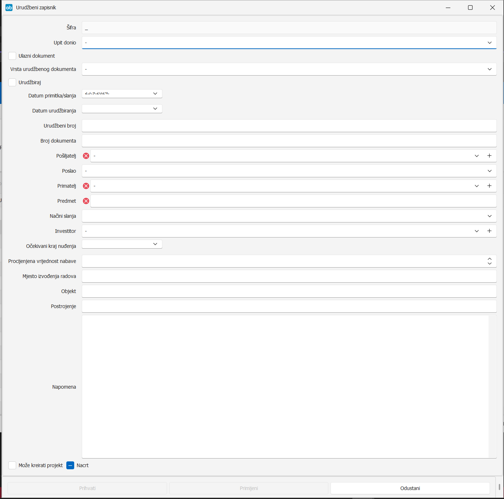

# Urudžbeni zapisnik  

### 
**Dodavanje urudžbenog zapisnika**

**
Put: Poslovanje -> Urudžbeni zapisnik -> Dodaj**
  

Prodaja urudžbira ulazne dokumente prodaje: upite, narudžbe, ugovore, ukoliko isti nisu došli preko tajništva (Mirela). U rijetkim slučajevima urudžbira i odlazne dokumente prodaje: ponuda, ugovor, iako se oni po pravilu, kao i sva ostala ulazna i izlazna dokumentacija urudžbiraju u tajništvu.

1. **UPIT DONIO**   
    Iz padajućeg izbornika odabrati osobu koja je donijela upit, ako je ta informacija poznata, a ako nije potrebno popunjavati.

2. **ULAZNI DOKUMENT**      
    Označiti checkbox ukoliko je riječ o ulaznoj dokumentaciji (upit, narudžba/ugovor kupca/naručitelja). 
    Ukoliko je riječ o izlaznoj dokumentaciji (ponuda, ugovor), tada checkbox ostaje neoznačen

3. **VRSTA URUDŽBENOG DOKUMENTA**    
    Iz padajućeg izbornika odabrati vrstu dokumenta koji se urudžbira: 
    − Dopis 
    − **Narudžba **
    − **Natječajna dokumentacija **
    − Ostalo 
    − Ponuda 
    − Račun 
    − **Ugovor **
    − **Upit **

4. **URUDŽBIRAJ**    
    Označavanjem checkboxa ulazni dokument, automatski se aktivira i  checkbox urudžbiraj. Svi ulazni dokumenti moraju imati označen checkbox urudžbiraj, jer u suprotnom AltiBiz neće generirati urudžbeni broj. 

5. **DATUM PRIMITKA/SLANJA**    
    Upisati datum kada je zaprimljen ulazni upit, narudžba, ugovor. To može biti na primjer datum maila kada je zaprimljen dokument, datum kada je dokument stigao poštom i sl.

6. **DATUM URUDŽBIRANJA**    
    Upisati datum kada se dokument urudžbira. 

7. **URUDŽBENI BROJ**    
    Obavezno ostaviti prazno, broj će generirati AltiBiz prilikom urudžbiranja.

8. **BROJ DOKUMENTA**    
    Upisati: broj narudžbe/ugovora kod kupca/naručitelja, evidencijski broj nabave (EBN) kod natječajne dokumentacije, broj upita (ako postoji). U slučaju da podatak ne postoji, ostaviti prazno.

9. **POŠILJATELJ (*obavezno polje*)**    
    Odabrati pošiljatelja (kupac/naručitelj) navedenog na narudžbi/ugovoru, naručitelja/kupca na kojeg treba glasiti ponuda (natječajna dokumentacija i upit). Ukoliko pošiljatelj ne postoji na popisu, tada je Mireli potrebno poslati zahtjev za otvaranjem novog partnera u AltiBizu. Kod svih izlaznih dokumenata pošiljatelj je HELB. 

10. **POSLAO**    
    Odabrati osobu koja je poslala dokument, ako je primjenjivo, a ako nije ostaviti prazno. 

11. **PRIMATELJ (*obavezno polje*)**    
    Kod svih ulaznih dokumenata primatelj je HELB, a kod izlaznih se odabire primatelj. Ukoliko primatelj ne postoji na popisu, tada je Mireli potrebno poslati zahtjev za otvaranjem novog partnera u AltiBizu. 

12. **PREDMET (*obavezno polje*)**    
    <ins>Natječajna dokumentacija</ins>: upisati naziv predmeta nabave iz natječajne dokumentacije 
    <ins>Upit</ins>: upisati predmet/naziv projekta 
    <ins>Narudžba</ins>: upisati pojam „Narudžba“ (prilikom odabira vrste urudžbenog dokumenta narudžba, u predmet se automatski upisuje „Narudžba“) 
    <ins>Ugovor</ins>: upisati naziv predmeta ugovaranja 

13. **NAČIN SLANJA**    
    Odabrati način primitka ili slanja dokumenta (e-mail, elektroničkim putem – npr. EOJN, dostava u slučaju da je dokument dostavio ili preuzeo HELB-ov dostavljač i dr.).

14. **INVESTITOR**    
    Upisati investitora prilikom otvaranja upita ili natječajne dokumentacije, ako je informacija poznata, a ako nije ostaviti prazno.

15. **OČEKIVANI KRAJ NUĐENJA**    
    Upisati datum do kada je potrebno dostaviti ponudu. U slučaju urudžbiranja narudžbe/ugovora, podatak se ne popunjava.

16. **PROCIJENJENA VRIJEDNOST NABAVE**    
    Upisati procijenjenu vrijednost nabave (PVN) iz natječajne dokumentacije ili ulaznog upita, ako podatak postoji. U slučaju urudžbiranja narudžbe/ugovora, podatak se ne popunjava. 

17. **MJESTO IZVOĐANJA RADOVA**    
    Upisati mjesto iz natječajne dokumentacije ili ulaznog upita, ako podatak postoji. U slučaju urudžbiranja narudžbe/ugovora, podatak se ne popunjava. 

18. **OBJEKT**    
    Upisati objekt iz natječajne dokumentacije ili ulaznog upita, ako podatak postoji. U slučaju urudžbiranja narudžbe/ugovora, podatak se ne popunjava. 

19. **POSTROJENJE**    
    Upisati postrojenje iz natječajne dokumentacije ili ulaznog upita, ako podatak postoji. U slučaju urudžbiranja narudžbe/ugovora, podatak se ne popunjava.
